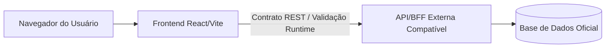

<p align="center">
  <h1 align="center">SUS Analytics Web</h1>
</p>

<p align="center">
  Painel web para visualização de contratos analíticos, acompanhamento territorial e apoio à gestão de dados da Atenção Primária à Saúde.
</p>

<p align="center">
  <a href="https://github.com/eduardomuniz/sus-analytics-web/actions/workflows/ci.yml">
    
  </a>
  <a href="LICENSE">
    
  </a>
  
  
</p>

<p align="center">
  <a href="#visão-geral">Visão geral</a> ·
  <a href="#instalação">Instalação</a> ·
  <a href="#uso-rápido">Uso rápido</a> ·
  <a href="#arquitetura">Arquitetura</a> ·
  <a href="#segurança">Segurança</a> ·
  <a href="#contribuição">Contribuição</a>
</p>

---

## Visão geral

SUS Analytics Web é um frontend *standalone* desenvolvido para apoiar a visualização de dados da Atenção Primária à Saúde (APS). Ele oferece uma interface moderna focada no consumo de contratos de dados analíticos, permitindo que profissionais de saúde e gestores acompanhem métricas territoriais e indicadores de qualidade.

A aplicação opera sem acesso direto a bancos de dados, delegando a autenticação, autorização e os cálculos normativos a uma API compatível. Isso garante a segregação de responsabilidades e facilita implantações em ambientes com restrições rigorosas de infraestrutura.

Atualmente, o projeto encontra-se em fase **experimental**, documentando suporte para renderização de 21 métricas (Qualidade APS e Vínculo/Acompanhamento Territorial) sem substituir os sistemas oficiais validados.

## Principais recursos

| Recurso | Descrição |
|---|---|
| **Painel interativo** | Interface React/Vite (SPA) para navegação rápida, acessível e responsiva. |
| **Validação de contratos** | Verificação rigorosa em runtime de payloads analíticos (estados `READY`, `NO_DATA`, `CONTRACT_ERROR`, etc.). |
| **Suporte a mapas** | Integração territorial para gestão visual e acompanhamento de microáreas locais. |
| **Execução fail-closed** | Comportamento defensivo que exibe indisponibilidade imediata perante APIs inoperantes, falta de configuração ou dados incompatíveis. |

## Preview

> [!NOTE]
> Capturas de tela e demonstrações interativas da interface serão disponibilizadas nas próximas atualizações conforme a estabilização do design system.

## Uso rápido

O projeto exige configuração prévia obrigatória (município, UF, IBGE, coordenadas e API) para renderizar a interface base. Sem os parâmetros corretos, o *bootstrap* será interrompido.

```bash
git clone https://github.com/eduardomuniz/sus-analytics-web.git
cd sus-analytics-web
pnpm install --frozen-lockfile
cp .env.example apps/frontend/.env.local
pnpm dev
```

> [!IMPORTANT]
> A aplicação bloqueia métricas fechadas que não tiverem comprovação de estabilidade ou versionamento (ex: métrica `C1`), apresentando um estado de bloqueio local em tempo de execução.

## Instalação

O repositório suporta execução via Docker ou ambiente local (Node.js/pnpm).

### Docker (Recomendado)

O repositório disponibiliza arquivos de containerização na pasta `docker/`:

```bash
docker compose -f docker/compose.yml up --build
```

### Desenvolvimento Local

Requisitos: Node.js 22 ou superior e pnpm 10.4 ou superior.

```bash
pnpm install --frozen-lockfile
pnpm build
pnpm start
```

## Configuração

Copie o `.env.example` (se existente) para `.env.local` e configure as variáveis. Nenhuma delas tem *fallback* padrão de produção para prevenir uso acidental.

| Variável | Obrigatória | Descrição | Exemplo seguro |
| -------- | ----------: | --------- | -------------- |
| `VITE_API_URL` | Sim | URL base da API compatível externa | `http://localhost:3000` |
| `VITE_MUNICIPIO` | Sim | Nome do município de operação | `Cidade Modelo` |
| `VITE_UF` | Sim | Sigla do Estado da Federação | `UF` |
| `VITE_IBGE` | Sim | Código IBGE municipal | `0000000` |
| `VITE_MAP_CENTER` | Sim | Centro geográfico inicial do mapa | `-15.7801,-47.9292` |

> [!WARNING]
> Nenhuma variável iniciada com `VITE_` deve conter senhas ou segredos, pois elas são incorporadas publicamente ao *bundle* da aplicação.

## Arquitetura

A aplicação opera como um consumidor isolado (frontend standalone). O acoplamento com a lógica de negócio ocorre exclusivamente via contratos estritos.



- **Frontend:** Construído com React, TypeScript e Vite. Gerencia o roteamento e a renderização das métricas.
- **Validação:** Checagens falham rápido (*fail-closed*) perante indisponibilidades externas.

## Estrutura do repositório

```text
.
├── apps/               # Módulos de aplicação principal e backend/core local
├── docker/             # Configurações de container e Docker Compose
├── docs/               # Documentação de arquitetura e contratos
├── scripts/            # Ferramentas locais de validação de build
├── .github/            # Workflows CI (Build e Security)
└── package.json        # Dependências do workspace
```

Para aprofundamento técnico, consulte `docs/architecture/product-boundary.md` e `docs/DEVELOPMENT.md`.

## Testes e qualidade

O projeto inclui *gates* rigorosos de publicação. Em ambiente local, execute:

```bash
pnpm check      # Validação estática de tipos (TypeScript)
pnpm format     # Verificação e aplicação do Prettier
pnpm test       # Executa a suite de testes locais (Vitest)
pnpm build      # Compilação e empacotamento com Vite/esbuild
```

A esteira de Continuous Integration executa verificações de testes, *typecheck* e *container security* a cada Pull Request.

## Segurança

A segurança foi pensada baseada na postura isolada do painel:

- **Política de *Secrets*:** Nenhum segredo ou token privado é hospedado localmente no código. Utilizar `.env` exclusivamente com dados sintéticos ou restritos.
- **Isolamento de Responsabilidade:** Funcionalidades vitais, como autorização, controle de acesso e cálculo distribuído, são tratadas explicitamente como "contratos externos", evitando o processamento de regras sigilosas no frontend.
- **Reporte:** Caso descubra problemas de segurança, utilize o mecanismo privado padrão do GitHub (`Security > Advisories`). Não publique informações sensíveis em issues abertas.

## Roadmap

| Status | Item |
| ------ | ---- |
| ✅ | Renderização de SPA e roteamento base experimental |
| ✅ | Validação fail-closed rigorosa de payloads externos |
| 🚧 | Documentação estendida de uso das métricas do catálogo APS |
| 🚧 | Visualização completa do acompanhamento territorial |
| 🧭 | Integração com provedor robusto de autenticação multiusuário |

## Contribuição

Contribuições para o refinamento da interface, documentação e correção de testes locais são muito bem-vindas.

1. Faça um *fork* e crie sua branch de desenvolvimento.
2. Certifique-se de executar `pnpm test` e `pnpm check`.
3. Abra um Pull Request e aguarde a validação dos *workflows* do GitHub Actions.

Para diretrizes detalhadas de código e colaboração, consulte a documentação ou a arquitetura.

## Licença

Distribuído sob a licença Apache 2.0. Consulte [LICENSE](LICENSE) e [NOTICE](NOTICE) para os devidos limites legais de cópia, distribuição e modificação.

## Créditos / Mantenedor

O software é mantido por Eduardo Muniz.

Este projeto é uma ferramenta de apoio analítico e **não tem intenção de substituir** o e-SUS APS, PEC Oficial ou os relatórios institucionais do Ministério da Saúde. Use com responsabilidade.
