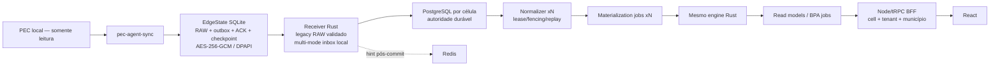

# Execução 2 — implementação P0 Adaptive Edge-to-Hub

- **Data:** 2026-08-12
- **Base:** `8c0ffb3cb0d03df3f5c3a6822f565653b0ba4434`
- **Branch integrada:** `feature/adaptive-edge-integration-20260812`
- **Classificação do recorte executado:** `VALIDATED_E2E_VERTICAL_SLICE`
- **Classificação da plataforma completa:** `NATIONAL_SCALE_NOT_PROVEN`
- **Limite:** não é `PRODUCTION_READY`, `CELL_READY` nem `NATIONAL_SCALE_READY`

## Resumo executivo

A arquitetura escolhida continua sendo **Adaptive Edge-to-Hub celular**. A Execução 2 transformou partes críticas do desenho em código e prova executável: identidade fail-closed, RAW-first em SQLite criptografado no Windows, materialização durável com fencing, inbox multi-mode, `DEFAULT_CELL` com RLS, paridade Rust cross-target de M1 e uma vertical BPA-C determinística. A vertical real limitada provou o caminho legado RAW de agente a resultado com PostgreSQL 16 e Redis 7 isolados, inclusive Redis indisponível e replay idempotente.

O resultado não promove a plataforma inteira. O endpoint multi-mode ainda é somente inbox, a execução E2E usou o endpoint legado, somente M1 dos 21 indicadores foi comparado entre Windows e Linux, o BPA-C não tem aceite normativo DATASUS/SIGTAP, e não houve PEC real, PITR, failover, ondas 50–1000 ou offline de 1–72 horas.

## 1. Branches, worktrees e frentes

Nenhuma frente alterou o checkout principal sujo. A integração ocorreu em worktree limpa e sem push.

| Frente | Branch/worktree isolado | Base/final da frente | Commit integrado |
|---|---|---|---|
| Integração e protocolo | `Equipe do projeto/adaptive-edge-integration-20260812` / `esus-aps-360-adaptive-integration-20260812` | base `8c0ffb3` | cadeia abaixo |
| Contratos v1 | `feature/adaptive-contracts-v1-20260812` / `esus-aps-360-adaptive-contracts-v1-20260812` | `6d845a9`, `fe5cb2c` | `44861de`, `6603158` |
| Security Boundary | `feature/adaptive-security-boundary-v1-20260812` / `esus-aps-360-adaptive-security-v1-20260812` | `b862434` | `af79ff6` |
| Edge SQLite | `feature/adaptive-edge-sqlite-v1-20260812` / `esus-aps-360-adaptive-edge-sqlite-v1-20260812` | base `cab6c8d`, final `336a620` | `2caa3ef` |
| Hub materialization | `feature/adaptive-hub-materialization-v1-20260812` / `esus-aps-360-adaptive-hub-materialization-v1-20260812` | base `cab6c8d`, final `cfa30b7` | `3998611` |
| Rules/parity | `feature/adaptive-rules-parity-v1-20260812` / `esus-aps-360-adaptive-rules-parity-v1-20260812` | base `e86a96c`, final `f2fb34f` | `f4298e5`, `a3d0aa6` |
| BPA-C | `feature/adaptive-bpa-c-v1-20260812` / worktree de mesmo sufixo | base `e86a96c`, final `dc16d52` | `e24d979` |
| DEFAULT_CELL | `feature/adaptive-default-cell-v1-20260812` / `esus-aps-360-adaptive-default-cell-v1-20260812` | base `3998611`, final `269a97d` | `3095419` |
| Benchmark/evidência | `feature/adaptive-benchmark-manifest-20260812` e `feature/adaptive-integration-chaos-v1-20260812` | `0d1480c`, `7545836` | `12825e7`, `79f0157`, `21127f1` |

## 2. Commits integrados

Da base até esta entrega: `4692a25`, `44861de`, `6603158`, `12825e7`, `49f6e88`, `cab6c8d`, `89d3160`, `e0ca5b5`, `e86a96c`, `af79ff6`, `2caa3ef`, `3998611`, `38cd5ea`, `f4298e5`, `a3d0aa6`, `df1af12`, `e24d979`, `3095419`, `79f0157` e `21127f1`, seguidos pelo commit documental/final desta execução.

Os commits de implementação foram cherry-picked; não houve rebase destrutivo nem push.

## 3. Arquivos alterados

Antes do fechamento documental, o delta tinha **270 arquivos**, **19.000 inserções** e **1.117 remoções**. A maioria dos arquivos é evidência imutável das duas execuções. Superfícies principais:

- `Apps/contracts/sus-aps-contracts/**`: envelopes, modos, identidade, hashes e attestations;
- `Apps/agent/pec-agent-sync/**`: EdgeState, migração, criptografia e integração do envio;
- `Apps/ingest/dm-sync-ingest/**`: auth Rust, inbox, normalizer e materializer;
- `Apps/rules/{sus-aps-rule-engine,b360-rules}/**`: engine M1 e fronteira celular;
- `Apps/server/api/src/{agents,bpa-c,routers,server}/**`: auth, BPA-C, BFF e escopo;
- `Apps/web/client/**`: módulo BPA-C real, sem resultado aleatório;
- `benchmarks/adaptive-edge/**`: esquema/CLI/runner, fixtures e duas execuções finais;
- `docs/33-adr/**` e `docs/02-architecture/**`: decisão, autoridade e evidência;
- `scripts/10-sql/default-cell-cross-tenant.sql` e `scripts/tests/windows/test-default-cell-postgres.ps1`: prova de isolamento/rollback.

A lista exata é reproduzível com `git diff --name-only 8c0ffb3..HEAD`.

## 4. Migrations

| Migration | Propósito | Prova |
|---|---|---|
| `agents/migrations.ts` | `recovery_token_hash` e unicidade para recuperação single-use | testes Node de rotação/negação |
| ingest `0003_materialization_jobs_v1` up/down | jobs, resultados e eventos duráveis | PG16+Redis7 real, down+reapply |
| ingest `0004_multimode_inbox_v1` up/down | inbox RAW/NORMALIZED/MATERIALIZED | PG16 real, conflito/idempotência/rollback |
| ingest `0005_default_cell_v1` up/down | `cell_id`, chaves compostas, roles e RLS | PG16 real cross-tenant e rollback |
| rules `0028_default_cell_v1` up/down | escopo celular e RLS nos read models selecionados | mesma prova PG16 |
| `bpa-c/migrations.ts` | jobs/resultados/eventos BPA-C aditivos | E2E PG16 com restart/reclaim |
| SQLite `user_version=1` | RAW, outbox, ACK, checkpoints, retry, commands e quarantine | testes de crash/restart/backup |

## 5. Rollback

- Materialização: parar worker/reconciler, aplicar `0003.down.sql`; o teste real preservou ingest legado e reaplicou o up.
- Multi-mode: parar novos produtores/consumidores e aplicar `0004.down.sql`; legado permanece.
- DEFAULT_CELL: remover previamente colisões não representáveis, aplicar rules `0028.down` e ingest `0005.down`; o ensaio preservou o tenant sobrevivente.
- Edge: policy força `RAW`; migração JSON é copy/import idempotente e mantém o original; binário anterior continua disponível. Banco/chave incompatíveis falham fechado.
- BPA-C: `BPA_C_V1_MODE=DISABLED` e restart restauram a superfície anterior. O schema é aditivo; não há down migration destrutiva nesta slice.
- Security Boundary: rollback de `recovery_token_hash` é possível, mas reabriria a vulnerabilidade; somente sob incidente controlado.

Migração entre células ainda não existe. O processo alvo permanece `PREPARING → COPYING → DUAL_READ → CUTOVER/ROLLED_BACK → COMPLETED`, com assignment versionado, snapshot, replay, parity e routing fenced.

## 6. Segurança

Foi implementada decisão única de autenticação com binding obrigatório de instalação, agente, tenant e município. Token ausente/desconhecido, binding ausente ou ambíguo, revogação, agente suspenso, instalação suspensa/inativa e mismatch são negados antes de descompressão e persistência. Re-registro exige token atual ou recovery token single-use; rotação invalida a credencial anterior. O payload não redefine a identidade autenticada.

`DEFAULT_CELL` introduziu roles `NOLOGIN/NOBYPASSRLS`, privilégio mínimo, `FORCE RLS`, scope transacional via `SET LOCAL` e cache com célula. A prova negativa usou IDs deliberadamente colidentes.

Bloqueios: mTLS não foi implementado; endpoints de runtime command poll/progress/result não existem; BPA-C ainda não recebeu RLS celular próprio; não há PKI/revogação end-to-end ou SBOM/proveniência completa.

## 7. SQLite e criptografia

O agente grava RAW+outbox em uma transação antes da rede. Após ACK durável, grava receipt, confirma outbox e avança checkpoint na mesma transação antes do POST de checkpoint. Retry e fallback reutilizam bytes, `raw_delta_id`, hash e chave idempotente.

SQLite usa WAL e `synchronous=FULL`. O payload é AES-256-GCM e a chave é protegida pelo DPAPI do service account no Windows. Isto **não é SQLCipher**: identificadores operacionais e schema permanecem visíveis, enquanto o payload clínico fica cifrado. Chave incorreta falha, o canário nominal não aparece em plaintext e backup/restore via `VACUUM INTO` foi verificado com a mesma chave. Linux/non-Windows falha fechado e permanece `BLOCKED`.

## 8. E2E executado

A vertical limitada foi executada com binários reais de agente/receiver/normalizer/materializer, fonte PostgreSQL sintética somente leitura, PostgreSQL 16 e Redis 7 descartáveis. Usou o endpoint legado RAW, porque o inbox multi-mode ainda não tem consumidor downstream.

- Wave 1: 1 chunk durável, 1 ACK/checkpoint SQLite, backlog `1→0` e 1 resultado. Redis estava indisponível durante o POST; o ACK declarou `pending_queue`. Após restart, identidade, hash e idempotência do RAW permaneceram iguais. Replay retornou `accepted_duplicate`, cardinalidade 1; cross-tenant retornou 401.
- Wave 10: 10 processos, 10 chunks, 10 ACKs e 10 resultados; backlog `10→0`. Replay preservou cardinalidade 10 e cross-tenant retornou 401.

Isto sustenta apenas `VALIDATED_E2E_VERTICAL_SLICE` para o caminho legado RAW delimitado.

## 9. Paridade

O engine puro M1@2026.6 foi executado em release Windows `x86_64-pc-windows-msvc` e Linux real em container. Os 823 bytes canônicos foram idênticos:

- output SHA-256: `af75a69637a68e8a5db1bde130bdfe523ac9dfc9e16a7e5d84ee14af6640152e`;
- semantic result hash: `8451410ccaf08255aac06cd5b1c56c999be7283f752498a4d60f7a67ce6c9cd7`.

É prova cross-target de **1 dos 21 indicadores**, não paridade global. A identidade semântica foi separada de target/build/BOM; saídas usam inteiros escalados e ordenação canônica.

## 10. BPA-C

A slice BPA-C inclui domínio/CLI Rust determinístico, agrupamento/ordenação/paginação canônicos, layout estrutural DATASUS de 09/07/2026, golden CRLF, job PostgreSQL com lease/fencing/retry, RBAC/ABAC/auditoria, canário/rollback e UI React sem `Math.random`. O E2E PG16 provou duplicata idempotente, persistência após restart e reclaim de lease expirado.

Classificação: `IMPLEMENTED_NOT_VALIDATED` e `BLOCKED_NORMATIVE`. Falta aceite de importação BPA/SIA real e certificação da elegibilidade SIGTAP. O BPA-C ainda não possui `cell_id`/`FORCE RLS`; o isolamento da slice é aplicativo por tenant+município.

## 11. Cross-tenant

O ensaio PG16 descartável validou colisões de chunk, job, idempotency key e source key entre tenants para ingest, compatibility, materialization result e BFF. Também validou missing scope, atributos das roles, privilégio mínimo, `FORCE RLS`, up/down e preservação do tenant sobrevivente. Linhas de compatibility sem atribuição confiável ficam em `__UNBOUND__`, invisíveis aos runtime roles.

Não foram provados na mesma execução: export BPA-C, Partner API, todos os caches/logs e tabelas filhas de rules sem trio de escopo próprio.

## 12. Faults

| Falha | Resultado |
|---|---|
| Redis indisponível no ingest | `PASS` limitado: PG pending queue e drain após retorno |
| Receiver indisponível antes do ACK | `PASS` limitado: RAW local preservado e reenviado |
| Duplicate/replay | `PASS`: efeito/cardinalidade idempotentes |
| Normalizer reorder/reclaim | `PASS` em PG/Redis isolados |
| Materializer stale fence/reclaim | `PASS` em PG/Redis isolados |
| Multi-mode commit/conflict/down-up | `PASS` no inbox isolado |
| Chave SQLite incorreta/plaintext | `PASS` fail-closed |
| Network loss estrito após commit Hub antes do ACK | `NOT_RUN` |
| PostgreSQL failover/PITR/cell loss | `NOT_RUN` |
| Disk full/corrupção controlada do arquivo | parcial em testes locais; chaos E2E `NOT_RUN` |
| PEC real/interferência | `NOT_RUN` |

## 13. Benchmarks

| Métrica | Wave 1 LOW | Wave 10 MEDIUM |
|---|---:|---:|
| ACK p50/p95/p99 | 2.085/2.085/2.085 ms | 42/50/50 ms |
| drain backlog | 2.420,161 ms | 2.794,577 ms |
| materialização | 436,071 ms | 605,753 ms |
| peak working set observado | 19.222.528 B | 19.435.520 B |
| CPU acumulada | 1.375 ms | 4.109,375 ms |
| SQLite total | 102.400 B | 1.024.000 B |

Os valores descrevem apenas o hardware e dataset sintético desta execução. Não suportam extrapolação 10→1000 nem SLO de produção.

## 14. Manifests e evidência

As execuções finais estão em:

- `benchmarks/adaptive-edge/executions/adaptive-real-wave-1-20260812i`;
- `benchmarks/adaptive-edge/executions/adaptive-real-wave-10-20260812a`.

Os manifests v2 registram commit, builds, dados, topologia, perfil, thresholds, métricas, comandos, hashes de stdout/stderr e evidências. Foram assinados com chave Ed25519 efêmera e revalidados com allowlist do fingerprint versionado. Isso é evidência local tamper-evident, **não** uma trust root independente de produção. Após auditoria, somente G1 ficou `PASS` no escopo medido; G0 e G2–G7 continuam `BLOCKED` onde a prova completa não ocorreu.

## 15. Blockers e próximo caminho

P0 antes de qualquer promoção:

1. ligar envelopes multi-mode a consumidores e provar Agent→Hub nos três modos;
2. implementar command/progress/result e planner/governor, com fallback RAW sem reler PEC;
3. executar paridade cross-target para 21/21 e golden clínico real;
4. levar BPA-C a RLS/cell e obter aceite normativo DATASUS/SIGTAP;
5. realizar proteção/interferência no PEC LOW/MEDIUM/HIGH;
6. executar waves 50/100/500/1000, offline 1/6/24/48/72 h e fairness;
7. provar backup/PITR/restore, RTO/RPO, HA e perda de célula;
8. fechar observabilidade, mTLS/PKI, SBOM, assinatura/proveniência e promoção canário/rollback;
9. implementar registry/assignment/routing/migração de células e agregação nacional certificada/deidentificada.

Não introduzir Kafka, Kubernetes ou banco por município antes de medições demonstrarem necessidade.

## 16. Scorecard atualizado — 26 eixos

Escala `0–10`, conservadora e baseada somente no delta integrado e nas provas descritas.

| # | Eixo | Nota | Fundamentação curta |
|---:|---|---:|---|
| 1 | Edge compute | 6 | Estado RAW pronto; compute adaptativo completo pendente |
| 2 | Eficiência de banda | 5 | compressão/delta; três modos não operam end-to-end |
| 3 | Proteção do PEC | 3 | fonte sintética; interference benchmark ausente |
| 4 | Control plane | 5 | contratos/policy; runtime de comandos ausente |
| 5 | Offline/retry | 7 | outbox, retry e restart provados; 1–72 h ausentes |
| 6 | Durable ingest | 8 | commit antes do ACK e fallback PG provados |
| 7 | Replay/idempotência | 8 | IDs/hashes e cardinalidade provados |
| 8 | Paridade Edge/Hub | 6 | cross-target real, mas somente M1 |
| 9 | Multitenancy | 6 | `DEFAULT_CELL`/RLS na slice selecionada |
| 10 | Segurança | 6 | auth fail-closed; mTLS/PKI/surfaces faltantes |
| 11 | HA | 4 | xN/fencing em worker; topologia HA não provada |
| 12 | DR/PITR | 2 | backup Edge; cell restore inexistente |
| 13 | Escala nacional | 2 | wave máxima 10 |
| 14 | Isolamento celular | 5 | DEFAULT_CELL real; routing/migração ausentes |
| 15 | APIs | 5 | BFF atual; Partner/Event e jobs grandes incompletos |
| 16 | Governança de regras | 6 | contratos/hashes/golden; lifecycle persistente incompleto |
| 17 | Qualidade de dados | 6 | source gates/lineage; canônico clínico/bitemporal pendentes |
| 18 | Observabilidade | 4 | logs/métricas parciais; OTel/alerts ausentes |
| 19 | Release/update | 5 | self-tests/rollback parcial; G0/G7 incompletos |
| 20 | UX operacional | 6 | BPA real e estados honestos; control UI incompleta |
| 21 | Paridade BPA | 6 | bytes/golden/job; aceite normativo ausente |
| 22 | Paridade indicadores | 6 | M1 e suite rules; 20 indicadores sem cross-target |
| 23 | LGPD | 6 | payload cifrado e scans; threat/retention completos faltam |
| 24 | Supply chain | 5 | audits sem high/critical; SBOM/provenance e cargo-audit faltam |
| 25 | Backup/restore | 4 | Edge comprovado; Hub/cell não |
| 26 | Evidência/benchmark | 7 | manifests assinados e waves 1/10; G5/G6/G7 bloqueados |

**Média indicativa: 5,35/10.** Não é um KPI de certificação: um único P0 de segurança, DR ou isolamento pode bloquear promoção independentemente da média.

## Decisão final

Continuar com Rust + PostgreSQL autoritativo por célula + Redis como hint + Node/tRPC BFF + React, usando o mesmo engine normativo em Edge e Hub. Consolidar `pec-agent-sync` e BPA na plataforma oficial, mantendo os serviços BPA legados somente durante canário e rollback. A próxima promoção admissível é de vertical para canário controlado, após fechar os P0 acima; não há base para declarar prontidão produtiva, celular ou nacional.
