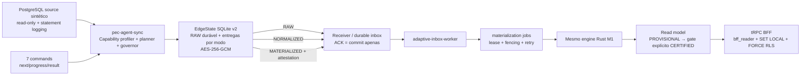

# Execução 3 — runtime adaptativo RAW/NORMALIZED/MATERIALIZED

- **Data da execução:** 2026-08-12/13
- **Branch integrada:** `Equipe do projeto/adaptive-edge-integration-20260812`
- **Base confirmada antes de alterações:** `6eb952a9141a2bf08c1852a3a40fc30906a54361`
- **HEAD antes deste fechamento documental:** `c2c379a7e859db3ebf05e60fbea8813905427857`
- **Worktree:** `esus-aps-360-adaptive-integration-20260812`
- **Estado inicial/final do worktree:** limpo; checkout principal sujo permaneceu intocado
- **Classificação máxima do recorte:** `VALIDATED_E2E_ADAPTIVE_THREE_MODE_SLICE`
- **Classificação da plataforma:** `NATIONAL_SCALE_NOT_PROVEN`
- **Limite:** não é `PRODUCTION_READY`, `CELL_READY` nem `NATIONAL_SCALE_READY`

## Resumo executivo

A Execução 3 fechou o delta operacional deixado pela Execução 2: o inbox
multi-mode passou a alimentar consumidores reais; o Edge passou a decidir e
executar RAW, NORMALIZED ou MATERIALIZED com governor e fallback; o Hub passou
a validar, recomputar/reconciliar e persistir o read model M1; os sete comandos
ganharam journal durável; o BFF leu os resultados sob `FORCE RLS`; e BPA-C
recebeu a fronteira celular no banco.

O mesmo input/identidade RAW M1 convergiu pelos três caminhos para bytes
canônicos e hash semântico idênticos. A wave 1 executou faults e comandos; a
wave 10 executou 10 agentes por modo, totalizando 30 resultados. Os manifests
finais foram assinados com Ed25519 efêmero e validados pela CLI.

Este é um recorte sintético e delimitado. Não houve PEC real, interferência
LOW/MEDIUM/HIGH, offline de uma hora, wave 50+, perda/restauração de PostgreSQL,
PITR ou promoção. A assinatura dos manifests é evidência local tamper-evident,
não uma raiz de confiança de produção.

## 1. Delta exato sobre a Execução 2

| Superfície | Execução 2 | Execução 3 |
|---|---|---|
| Multi-mode | inbox sem downstream | RAW/NORMALIZED/MATERIALIZED até read model |
| Edge compute | RAW-first e engine separado | profiler, planner, governor e executor M1 integrados |
| Fallback | replay RAW legado | MATERIALIZED→RAW e NORMALIZED→RAW após compute candidato, sem nova SELECT |
| Commands | contratos incompletos/sem runtime | `next/progress/result`, sete tipos, journal, lease, attempt, sequence e resultado idempotente |
| MATERIALIZED | contrato | attestation Ed25519, reconciliação Hub, `PROVISIONAL` e gate explícito de certificação |
| BFF | read models anteriores | router M1 real sob `bff_reader`, `SET LOCAL` e `FORCE RLS` |
| Linux keystore | fail-closed/bloqueado | Secret Service real: create→restart→restore; negativos fail-closed |
| BPA-C | isolamento aplicativo | `cell_id`, chaves compostas, roles, `FORCE RLS`, resultado/auditoria escopados e rollback |
| E2E | endpoint legado RAW, waves 1/10 | três modos, waves 1/10, faults, comandos e BFF |
| Evidência | vertical RAW | manifests assinados do three-mode slice |

O delta integrado de `6eb952a..c2c379a` é de **95 arquivos**, **9.695
inserções** e **405 remoções** antes deste relatório.

## 2. Frentes, worktrees e commits

Nenhuma frente alterou o checkout principal. Não houve push.

| Frente/agente | Branch/worktree | Commit fonte | Commit integrado |
|---|---|---|---|
| Contratos Hub/Edge | `Equipe do projeto/exec3-hub-runtime-20260812` | `78e51c7`, `4576971`, `a5a5b4d`, `3493dba`, `65610dd` | `44f4a5e`, `8cf3834`, `8e3df2a`, `a3d2d3a`, `6709947` |
| BPA-C cell/RLS | `Equipe do projeto/exec3-bpa-cell-20260812` | `9194503` | `ed04d7f`, ajuste drift `88cb725` |
| Hub runtime | `Equipe do projeto/exec3-hub-runtime-20260812` | `41cc899` | `d7eea14` |
| Edge runtime | `Equipe do projeto/exec3-edge-adaptive-20260812` | `01fc71a` | `53a730c` |
| Integração — volume Windows | branch integrada | — | `575b17a` |
| Integração — vigência M1 | branch integrada | — | `dfee6da` |
| Integração — timestamps commands | branch integrada | — | `95e9bce` |
| Harness/chaos | `Equipe do projeto/adaptive-integration-chaos-v2-20260812` | `be72587` | `c2c379a` |

Agentes da Execução 3: `exec3_edge_adaptive`, `exec3_hub_runtime`,
`exec3_bpa_cell` e `integration_chaos_benchmark`, coordenados pelo owner da
integração.

## 3. Implementação Edge

### Capability profiler

O `pec-agent-sync` publica manifesto sanitizado e mede CPU total/disponível,
pressão, RAM/swap, disco livre, latência do probe de disco, backlog/idade,
tamanho do delta, latência de rede, source health, latência da query,
compatibilidade de schema, engine/rules e golden self-test.

O bug de volume descoberto pelo harness foi corrigido em `575b17a`:
`canonicalize()` no Windows devolvia caminhos `\\?\C:\...`, incompatíveis com
os mount points do profiler. A normalização agora cobre caminho local estendido
e UNC, com teste sobre volume temporário real.

### Planner e governor

- policy central limita modos; a decisão final permanece local;
- state de decisão/hysteresis/cooldown é persistido;
- thresholds são identificados como conservadores e não calibrados para
  produção;
- governor limita concorrência de query/processamento, batch, CPU, memória e
  backlog;
- sob pressão, reduz concorrência/batch, pausa compute e degrada
  `MATERIALIZED → NORMALIZED → RAW` ou diretamente para RAW emergencial;
- RAW nunca é descartado.

Na prova de pressão, o candidato local foi iniciado, a observação real mudou,
o candidato foi abortado em fronteira segura e o RAW já persistido foi enviado.
Não se alega preempção no meio de uma fórmula.

### EdgeState v2 e comandos

SQLite `user_version=2` mantém uma entrega cifrada e independente por
`(raw_delta_id, processing_mode)`. ACK de um modo não confirma outro. Replay
reutiliza bytes de envelope, content hash e idempotency key. O journal local de
comandos cifra leases, policies, argumentos e resultados; attempt e delivery
sequence são cercados.

Os sete comandos são:

- `RUN_DIAGNOSTIC`;
- `REFRESH_SOURCE_HEALTH`;
- `REPROCESS_SCOPE`;
- `CHANGE_EXECUTION_POLICY`;
- `UPDATE_AGENT`;
- `ROTATE_CREDENTIAL`;
- `VERIFY_RULE_PACKAGE`.

Cinco tiveram o resultado seguro esperado. `UPDATE_AGENT` foi rejeitado por
ausência de artefato assinado e `ROTATE_CREDENTIAL` por ausência de prova
administrativa de recuperação; são resultados fail-closed, não falhas do gate.

## 4. Implementação Hub

### Caminhos

- **RAW:** valida envelope/source contract, normaliza no Hub, cria job, executa
  o engine M1 e persiste read model.
- **NORMALIZED:** valida snapshot, lineage, schema e hashes; não repete a etapa
  de normalização; materializa e persiste.
- **MATERIALIZED:** valida descriptor, rule semantic/golden hashes, binary,
  target, build, BOM, provenance, assinatura Ed25519, snapshot e lineage;
  persiste `PROVISIONAL`; o Hub recomputa com o input de reconciliação e exige
  `MATCH` antes de qualquer promoção.

`CERTIFIED` só é criado pelo gate transacional explícito e com todos os hashes
esperados. O ACK do receiver continua significando apenas commit durável no
inbox, nunca materialização ou certificação.

### Migrations e rollback

| Migration | Conteúdo | Rollback |
|---|---|---|
| ingest `0006_adaptive_m1_downstream_v1` | normalized inputs, read models, trust de pacote, certification gates, roles/RLS | transação fail-closed; recusa se houver evidence/read model/trust/gate; exportar/reter antes do down |
| ingest `0007_command_runtime_v2` | commands/progress/results, sequence, monotonic trigger, `command_issuer`, RLS | transação fail-closed; journal deve estar vazio e previamente retido |
| Edge SQLite v2 | adaptive deliveries, planner/policy e command journal cifrados | rollback funcional força RAW; downgrade do arquivo exige backup/migração explícita, não abertura destrutiva |
| BPA `0001` + `0002` | baseline explícita, `DEFAULT_CELL`, results, PK/FK compostas, roles/RLS | `0002 down` antes de `0001`; recusa colisões; reidrata resultado no job |

Runtime não executa DDL de BPA no startup: `runBpaCMigrations` é preflight
read-only; apply/down usam CLI e credencial de migration owner.

## 5. Segurança e isolamento

- receiver executado com login não-superuser, sem `BYPASSRLS`, membro apenas
  de `ingest_writer` e com leitura explícita do ledger de migrations;
- autenticação/binding de agent, installation, tenant e municipality ocorre
  antes da persistência;
- inbox, jobs, read models, commands e BPA usam chave/escopo celular composto;
- BFF usa `bff_reader` em transação com scope local e `FORCE RLS`;
- cross-tenant no receiver/commands retornou 403;
- BFF confirmou negação fora do escopo;
- payload RAW e chaves privadas efêmeras não foram versionados nos artefatos.

O harness revelou e a integração corrigiu um bind incorreto de timestamps:
`observed_at`/`completed_at` RFC3339 eram enviados como `text` para
`timestamptz`. `95e9bce` faz parse estrito para `DateTime<Utc>`, retorna 400 em
valor inválido e liga o tipo correto ao SQL.

mTLS/PKI, TUF ou raiz offline, rotação nacional, SBOM/provenance de release e
scanner de vulnerabilidade global ainda não estão fechados.

## 6. Paridade M1

Nos dois runs, os três caminhos produziram:

- semantic result hash:
  `1210f1f4218028c10bb9d1142e59a2e813224ceff414440079f2c3f688802d3e`;
- canonical result SHA-256:
  `16502f0fcb788d9ceb74e7670e08a33c2c2adc464fefc6bb87fb250214e62e35`;
- numerator `387`;
- denominator `320`;
- metric scaled `1209375`;
- classification `SUFFICIENT`;
- clinical status `READY`;
- reason codes `M1_READY`, `M1_SCALED_INTEGER_1E6`;
- source snapshot `exec3-m1-snapshot-20260812`;
- igualdade de result payload, lineage hash, rule version, rule semantic hash,
  source snapshot e raw identity.

O harness detectou que o descriptor usava `2026-06-12`, data de assinatura do
documento, como início de vigência, bloqueando o golden com cutoff
`2026-04-30`. A fonte normativa registra `effective_from=2025-12`; `dfee6da`
separou assinatura de vigência e adicionou regressão.

Limite: M1 é 1 dos 21 indicadores. O status de 21/21 permanece não provado.

## 7. Fallback e contagem de SELECT

Wave 1 realizou cinco capturas: uma por estado SQLite independente dos três
modos e duas para os cenários de pressão. Wave 10 realizou 30: uma por agente e
modo. O isolamento por arquivo evita que uma medição aqueça ou confirme a
outra; a identidade RAW, os bytes canônicos e o payload hash são iguais entre
os modos.

Nos dois faults de pressão:

- MATERIALIZED foi selecionado, compute candidato iniciou e abortou;
- NORMALIZED foi selecionado, compute candidato iniciou e abortou;
- ambos enviaram RAW;
- `source_query_count_before == source_query_count_after == 1`;
- `reused_persisted_raw=true`;
- nenhuma nova SELECT ocorreu no fallback.

No replay após kill/restart, o envio RAW registrou `sourceQueryCount=0`.

O que não foi provado fisicamente: um único arquivo SQLite compartilhando as
três entregas durante a mesma wave. O código/teste local cobre a chave
`(raw_delta_id, mode)`; o E2E manteve arquivos por modo para isolamento de
benchmark.

## 8. Fault matrix executada

| Fault | Resultado |
|---|---|
| kill após commit SQLite | PASS: RAW cifrado presente; restart prosseguiu |
| perda após commit PostgreSQL antes do ACK | PASS: retry dos mesmos bytes virou duplicata idempotente |
| Redis indisponível no ingest | PASS: ACK durável via PostgreSQL/pending hint e recuperação |
| duplicata | PASS: cardinalidade estável |
| pressão durante compute MATERIALIZED | PASS: candidato abortado, RAW reutilizado, delta SELECT zero |
| pressão durante compute NORMALIZED | PASS: candidato abortado, RAW reutilizado, delta SELECT zero |
| restart após claim do materializador | PASS: lease expirou, reclaim/fencing e resultado único |
| cross-tenant | PASS: 403 e RLS/deny no BFF |
| command lease/reclaim/max attempts/order | PASS em PostgreSQL real descartável |
| perda do POST terminal de command result | `BLOCKED_NOT_RUN_LIVE`; somente teste unitário |
| PostgreSQL loss/PITR/cell loss | `NOT_RUN` |
| offline ≥ 1 h | `NOT_RUN` |

## 9. Benchmark delimitado

| Métrica | Wave 1 | Wave 10 |
|---|---:|---:|
| agentes por modo | 1 | 10 |
| read models | 3 | 30 |
| ACK p50/p95/p99 | 65 / 2.088 / 2.088 ms | 41 / 2.088 / 2.097 ms |
| RAW comprimido | 1.127 B | 11.276 B |
| NORMALIZED comprimido | 1.103 B | 11.026 B |
| MATERIALIZED comprimido | 1.692 B | 17.014 B |
| processamento RAW/NORMALIZED/MATERIALIZED | 329 / 311 / 4.030 ms | 3.137 / 2.994 / 40.165 ms acumulados |
| peak RAM Edge por modo | 43,8 / 39,7 / 51,7 MB | 53,0 / 53,4 / 52,4 MB |
| disk probe min/p50/p95/max | 3 / 4 / 5 / 5 ms | 2 / 3 / 4 / 4 ms |
| drain worker→último evento | 6.249 ms | 8.229 ms |
| fallback nominal | 0/3 | 0/30 |
| fallback sob pressão | 2/2 | não repetido |
| source SELECTs | 5 | 30 |
| backlog final (proxy inbox/jobs) | 2 / 0 | 0 / 0 |

O proxy de inbox da wave 1 inclui os dois envelopes de pressão enviados depois
do drain delimitado; não é uma série temporal direta de status. Nenhum valor é
extrapolado para 50–1.000 agentes ou para SLO de produção.

## 10. BFF

O probe real usou o router tRPC, login de produção no papel `bff_reader`, scope
transacional e `FORCE RLS`. Foram 20 chamadas; p95 `9,8233 ms`. A consulta
autorizada retornou RAW, NORMALIZED e MATERIALIZED com o mesmo semantic hash e
status `PROVISIONAL`; a consulta sem permissão foi negada. O probe não foi
repetido na wave 10.

## 11. SQLite Windows/Linux

Isto permanece **criptografia de campos**, não full-database encryption.

- payloads, envelopes, policies, command data, leases e resultados:
  AES-256-GCM;
- metadados visíveis: schema, IDs/hashes operacionais, cursores, contagens,
  timestamps, states, attempts, sequences e `key_version`;
- Windows: DEK protegida por DPAPI da conta do serviço;
- Linux: Secret Service/keyring 3.6.3 via D-Bus;
- `key_version=1`; rotação futura exige cópia/recriptografia/transação e canário;
- restore exige SQLite/WAL/SHM + mesma entry/identidade do keystore;
- perda da chave é irrecuperável; crypto-shredding remove a entry após
  autorização/retenção.

Gate Linux real: `rust:1.88-bookworm`, D-Bus 1.14.10 e gnome-keyring 42.1.
Create→restart→restore passou; daemon ausente, conta errada e coleção/chave
errada falharam fechado. A primeira tentativa com literal foi classificada
`INVALID_EVIDENCE`, removida e não é contada.

## 12. BPA-C cell/RLS

BPA-C agora possui:

- `cell_id` em job/result/audit;
- PK/UK/FK por célula+tenant+município;
- owner de migration separado;
- `bpa_bff`, `bpa_worker` e `bpa_audit_reader` `NOLOGIN/NOBYPASSRLS`;
- RLS + `FORCE RLS` nas três tabelas;
- `SET LOCAL ROLE` e scope em cada transação;
- claim do worker por scope exato;
- download/export cross-tenant `NOT_FOUND` e deny auditado;
- rollback real com IDs colidentes, preservação de bytes/hash e reapply.

Status normativo permanece `IMPLEMENTED_NOT_VALIDATED` e
`BLOCKED_NORMATIVE`. Não houve aceite BPA/SIA real, elegibilidade SIGTAP por
competência ou prova de rejeição zero.

## 13. Manifests e gates

Execuções finais versionadas:

- `exec3-adaptive-wave-1-20260812t-validated2` — fingerprint externo
  `dbad2f08204e9facd8aebbe8b48ec667997af9c24135f4090178800b47ccb288`;
- `exec3-adaptive-wave-10-20260812t-validated1` — fingerprint externo
  `1741a73b1107b2b957f5b6dbff8807c2647eb301516ecbde0de1dfe0dd6591e5`.

Ambos: `MANIFEST_VALID`. Testes do manifesto 17/17; sintaxe Node, Python e
PowerShell; diff-check; scan de segredo/PII/chave privada; zero raw logs; zero
private key versionada. As chaves efêmeras foram removidas.

| Gate | Estado Execução 3 | Limite |
|---|---|---|
| G0 | `BLOCKED` | fmt/clippy/tests/scans/assinaturas locais passaram; faltam SBOM, vulnerability/provenance policy global e trust root de release |
| G1 | `PASS_BOUNDED` | agente, source sintético read-only, Hub PG16, Redis7, receiver, workers e BFF reais |
| G2 | `PASS_BOUNDED` | binding, 403, roles/RLS, BFF e BPA no recorte; não todas as superfícies nacionais |
| G3 | `PASS_BOUNDED` | M1 three-mode 100%; 20 indicadores faltam |
| G4 | `PASS_BOUNDED_SYNTHETIC_SOURCE` | read-only/statement log/fallback sem nova SELECT; não é PEC real/interference |
| G5 | `BLOCKED` | waves 1/10; 50+ e offline ≥1 h ausentes |
| G6 | `BLOCKED` | faults do recorte passaram; result POST lost, PostgreSQL loss e PITR ausentes |
| G7 | `BLOCKED` | BFF e rollback passaram; canário/promoção não executados |

## 14. Scorecard — 26 eixos

Escala conservadora `0–10`, sem converter média em certificação.

| # | Eixo | Exec. 2 | Exec. 3 | Evidência/limite |
|---:|---|---:|---:|---|
| 1 | Edge compute | 6 | 8 | três modos, planner/governor; só M1 |
| 2 | Eficiência de banda | 5 | 7 | bytes medidos por modo; dataset pequeno |
| 3 | Proteção do PEC | 3 | 4 | read-only/fallback provados em source sintético; PEC real ausente |
| 4 | Control plane | 5 | 7 | sete commands e journal; PKI/promoção ausentes |
| 5 | Offline/retry | 7 | 7 | faults curtos; 1–72 h ausentes |
| 6 | Durable ingest | 8 | 9 | post-commit/pre-ACK real e role mínima |
| 7 | Replay/idempotência | 8 | 9 | mode-scoped, duplicate e hashes reais |
| 8 | Paridade Edge/Hub | 6 | 8 | three-mode M1 integral; 20 indicadores faltam |
| 9 | Multitenancy | 6 | 7 | ingest/commands/BFF/BPA com RLS no recorte |
| 10 | Segurança | 6 | 7 | attestation/keystore/roles; mTLS/TUF ausentes |
| 11 | HA | 4 | 4 | reclaim/fencing; topologia HA ausente |
| 12 | DR/PITR | 2 | 2 | Edge restore; célula/PITR ausentes |
| 13 | Escala nacional | 2 | 2 | wave máxima 10 |
| 14 | Isolamento celular | 5 | 6 | DEFAULT_CELL+BPA; routing/migração ausentes |
| 15 | APIs | 5 | 7 | BFF e commands reais; Partner/Event incompletas |
| 16 | Governança de regras | 6 | 7 | attestation/trust/cert gate; lifecycle amplo pendente |
| 17 | Qualidade de dados | 6 | 7 | strict schemas, lineage e reconciliation M1 |
| 18 | Observabilidade | 4 | 5 | manifests/metrics; OTel/alerts/séries backlog ausentes |
| 19 | Release/update | 5 | 6 | attestation e fail-closed update; trust root/SBOM pendentes |
| 20 | UX operacional | 6 | 6 | status honestos; painel de control plane incompleto |
| 21 | Paridade BPA | 6 | 6 | RLS/durabilidade; aceite normativo ausente |
| 22 | Paridade indicadores | 6 | 6 | M1 provado; 20 indicadores faltam |
| 23 | LGPD | 6 | 7 | field encryption, scans, evidência sanitizada |
| 24 | Supply chain | 5 | 6 | assinatura/BOM local; SBOM/audit/provenance global ausentes |
| 25 | Backup/restore | 4 | 5 | Windows/Linux Edge; Hub/cell ausente |
| 26 | Evidência/benchmark | 7 | 8 | waves 1/10 three-mode assinadas; 50+/PITR ausentes |

**Média indicativa: 6,27/10**, contra 5,35 na Execução 2. Um P0 de DR,
segurança ou isolamento bloqueia promoção independentemente da média.

## 15. Blockers residuais

1. terminal command result perdido após execução e antes do POST não foi
   reentregue em fault de rede live;
2. PEC real e interferência LOW/MEDIUM/HIGH não foram executados;
3. offline ≥1 h, fairness e disk pressure prolongado não foram executados;
4. wave 50+ não foi executada; não extrapolar 10→1.000;
5. PostgreSQL loss, PITR/restore, RTO/RPO, HA e cell loss não foram executados;
6. backlog age/status precisa de série temporal direta, não proxy;
7. paridade cross-target/three-mode permanece M1, não 21/21;
8. mTLS/PKI, release trust root, SBOM/provenance/vulnerability gate e rollout
   canário permanecem abertos;
9. BPA-C permanece bloqueado normativamente;
10. um arquivo SQLite único com três entregas concorrentes não foi exercitado
    na wave, que usou estados independentes por modo.

## 16. Delta exato proposto para a Execução 4

A Execução 4 não deve redesenhar o runtime. Deve fechar estes gates, nesta
ordem e com stop-on-first-breach:

1. **Command lost-result live:** cortar rede depois do handler e antes do POST
   terminal; redelivery com attempt/delivery/lease novos e resultado canônico
   idempotente, sem reexecutar side effect.
2. **Single-state three-mode:** um único EdgeState, uma captura RAW e três
   entregas mode-scoped sequenciais; SELECT total 1 e ACKs independentes.
3. **Backlog telemetry:** status/age/time series diretas de inbox, jobs e
   EdgeState, métricas bounded-cardinality, dashboards e alertas.
4. **PEC protection autorizado:** perfis LOW/MEDIUM/HIGH, baseline→agent→recovery,
   query sentinela, locks, CPU/I/O e pause/downgrade do governor; sem tocar PEC
   produtivo sem janela/autorização.
5. **Offline/scale incremental:** 1 h offline e wave 50 primeiro; somente
   avançar se SLOs, fairness, disco e interferência passarem.
6. **DR celular:** backup base+WAL, PITR em célula nova, Redis reconstruído,
   validação de inbox/jobs/read models/lineage e RTO/RPO medidos.
7. **Release trust:** SBOM, provenance, dependency/cargo audit, root de
   assinatura independente e update/rollback canário.
8. **Paridade adicional:** levar o mesmo harness ao próximo indicador
   `ACTIVE_AND_PROVEN`; não declarar 21/21 por extrapolação.

Mesmo com esse delta, `CELL_READY` ou `NATIONAL_SCALE_READY` só poderão ser
avaliados depois de registry/routing/migração de células, HA e waves maiores.

## Decisão

Manter a arquitetura Adaptive Edge-to-Hub celular: Rust no Edge/ingest/engine,
PostgreSQL como autoridade durável, Redis somente como hint e Node/tRPC como
BFF escopado. Não introduzir Kafka, Kubernetes ou banco por município para
resolver lacunas que hoje são de prova, DR, segurança e operação.

O objetivo desta execução foi atingido no recorte declarado:
`VALIDATED_E2E_ADAPTIVE_THREE_MODE_SLICE`. A plataforma completa permanece
`NATIONAL_SCALE_NOT_PROVEN`.
