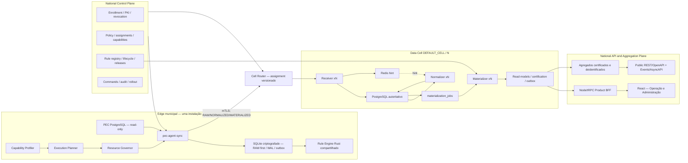

# Relatório unificado — SUS APS 360 Adaptive Edge-to-Hub celular

Data da auditoria e da decisão: 2026-08-12

Base de integração: `8c0ffb3cb0d03df3f5c3a6822f565653b0ba4434`

Branch: `Equipe do projeto/adaptive-edge-integration-20260812`

Classificação geral: **`NATIONAL_SCALE_NOT_PROVEN`**

> **Addendum da Execução 4 (2026-08-17):** a evidência executada mais recente
> está em `docs/02-architecture/adaptive-edge-execution-4-2026-08-13.md`. O recorte
> bounded fechou lost-result, single-state three-mode, offline 1 h, wave 50,
> PITR/restore, Redis rebuild, release trust, mTLS, canário, M2 e observabilidade,
> recebendo `VALIDATED_E2E_ADAPTIVE_RESILIENCE_EXEC4_SLICE`. PEC real não foi
> autorizado, a PKI é de teste, M1/M2 representam 2/21 indicadores e 100–1.000,
> 6–72 h e HA ampla não foram executados. A tarefa está `CLEANUP_BLOCKED` por
> três worktrees preexistentes alheios; o todo continua
> `NATIONAL_SCALE_NOT_PROVEN`.
>
> **Addendum da Execução 3:** a implementação e as provas mais recentes estão em
> `docs/02-architecture/adaptive-edge-execution-3-2026-08-12.md`; a Execução 2 foi
> preservada como histórico do delta. Este relatório A–O continua sendo baseline
> e decisão arquitetural. O recorte sintético M1 recebeu
> `VALIDATED_E2E_ADAPTIVE_THREE_MODE_SLICE`; o todo permanece
> `NATIONAL_SCALE_NOT_PROVEN`.

## Resumo executivo

A melhor arquitetura para o SUS APS 360 é uma **plataforma celular Adaptive Edge-to-Hub**, com:

- um único agente oficial, `pec-agent-sync`;
- persistência local RAW-first, transacional e criptografada;
- escolha adaptativa entre `RAW`, `NORMALIZED` e `MATERIALIZED`;
- uma única semântica normativa Rust, compartilhada entre Edge e Hub;
- PostgreSQL como autoridade durável de cada célula e Redis apenas como sinal de trabalho;
- células de dados por capacidade e domínio de falha, começando por `DEFAULT_CELL`;
- Control Plane nacional separado do processamento clínico;
- plano nacional de agregação/API consumindo apenas resultados permitidos, certificados e deidentificados;
- React como shell único de produto e Node/tRPC como BFF, sem cálculo normativo no browser ou TypeScript;
- incorporação das capacidades válidas de Análise PEC/BPA e retirada progressiva do Core, agente e painel paralelos.

Essa decisão preserva as melhores partes existentes: ingestão durável antes do ACK, recuperação pelo PostgreSQL, leases/fencing/DLQ, regras Rust, golden bundles e o BFF atual. Não introduz Kafka, Kubernetes ou banco por município porque nenhum deles fecha os bloqueadores presentes de identidade, multitenancy, materialização contínua, determinismo e recuperação.

Nesta execução foram entregues e validados localmente:

1. inventário de Fase 0 e matriz APS/BPA;
2. ADR 0005 evoluída e ADRs 0006/0007;
3. crate Rust transport-neutral `sus-aps-contracts` com protocolo v1;
4. manifesto executável de benchmark/evidência que recusa `PASS` sem prova;
5. este relatório A–O e scorecard de 26 eixos.

Não foram instalados serviços, alterados bancos, drenado backlog, desligado agente ou executada carga. A working copy principal e a working copy do BPA estavam sujas; todo código novo foi integrado em worktree limpa.

### Estado por entrega

| Entrega | Estado | Evidência |
|---|---|---|
| Inventário, arquitetura alvo e plano de migração | `DESIGNED` | ADRs e documentos versionados |
| Contratos Adaptive v1 | `VALIDATED_LOCAL` | fmt, clippy `-D warnings`, 10/10 testes Rust |
| Manifesto de benchmark/evidência | `VALIDATED_LOCAL` | Node check, 11/11 testes |
| Agente/ingest/normalizer/rules existentes para a arquitetura alvo | `IMPLEMENTED_NOT_VALIDATED` | componentes parciais, sem E2E target completo |
| Adaptive Edge, cells, mTLS, RLS, HA e escala nacional | `NATIONAL_SCALE_NOT_PROVEN` | gates reais ainda ausentes |

## A. Estado anterior

### APS 360

Fluxo observado:

```text
PEC -> pec-agent-sync -> receiver Rust -> PostgreSQL inbox
                                      -> Redis hint
                                      -> normalizer Rust
                                      -> normalized_records/projections
                                      -> materializer Rust CLI
                                      -> read model -> Node/tRPC BFF -> React
```

Pontos fortes:

- receiver confirma apenas após persistência durável;
- Redis degradado não elimina a recuperação pela fila PostgreSQL;
- normalizer implementa claim, lease, fencing, retry, DLQ e ACK posterior ao resultado durável;
- regras e materialização Rust possuem registry de 21 indicadores, lineage, golden bundles e transação;
- BFF já filtra tenant e município em caminhos importantes;
- UI principal já consome a autoridade Rust no baseline de integração.

Limitações críticas:

- agente usa arquivos JSON para checkpoint, spool, outbox, identidade e credenciais;
- o modo atual é essencialmente RAW e não possui profiler, planner ou governor;
- normalizer usa autoridade global/single-scope e não prova execução xN/multi-cell;
- projections de compatibilidade possuem chave global `source_key`, com risco de colisão cross-tenant;
- não existem `materialization_jobs` duráveis nem materializer worker contínuo;
- não há cells, RLS/FORCE RLS, papéis mínimos ou partições comprovadas;
- Edge não executa o mesmo engine normativo do Hub;
- resultado não separa estado clínico de `PROVISIONAL|CERTIFIED`;
- runtime central do produto não estava ativo na observação local de 2026-08-12;
- só existe evidência de smoke para dez agentes, não para 50–1000.

### Análise PEC/BPA

Capacidades úteis encontradas:

- domínio BPA-I/BPA-C;
- busca por paciente, CID e procedimento;
- exports PDF, XLSX e layout fixo oficial;
- fila anterior ao envio, retry/quarantine/checkpoint;
- update com hash, swap, backup e rollback;
- comandos/progresso/resultados operacionais.

Problemas estruturais:

- segundo agente Windows e segundo painel violam o objetivo de uma plataforma;
- Core concentra estado sob `Mutex` e persiste snapshots inteiros em `core-state.json`;
- agente envia `DashboardSnapshot` processado e nominal, não delta RAW canônico;
- credenciais e envelopes também ficam em arquivos locais sem proteção adequada;
- troca de arquivo apresenta janela de perda no Windows;
- BPA no APS ainda é incompleto: há UI com `Math.random()` e gerador que não produz o layout oficial real.

Na observação do host, `PecAgentSync` e `BPAInsightAgent` estavam ambos configurados como serviços automáticos. Nenhum foi alterado nesta execução.

## B. Decisões

| Natureza | Decisão |
|---|---|
| Absorvido | domínio BPA-I/BPA-C, filtros, procedimentos, CID, pesquisa nominal autorizada, exportadores, workload e conceitos de update/rollback |
| Absorvido | durable inbox, Redis hint, leases/fencing/DLQ, regras Rust, golden bundle, lineage, BFF e React shell do APS |
| Reimplementado | fila/checkpoint/outbox BPA e APS em SQLite transacional criptografado; não copiar o file queue |
| Reimplementado | BPA core/export normativo como crates e workers sem `Mutex` global ou snapshot inteiro |
| Reimplementado | enrollment, revogação e update com mTLS, keystore do SO e metadata assinada por raiz independente |
| Reimplementado | cálculo normativo em engine Rust puro com adapter PostgreSQL e adapter SQLite |
| Substituído | JSON local nominal por SQLite WAL com integridade, quota, quarantine e repair |
| Substituído | materializer CLI/manual por `materialization_jobs` PostgreSQL + workers xN e reconciler |
| Substituído | projections globais por chaves `(cell, tenant, municipality, source_key)` e RLS/FORCE RLS |
| Substituído | hash operacional por `semantic_result_hash` independente de UUID, clock, run e placement |
| Retirado | `BPAInsightAgent`, Core e UI BPA paralelos após paridade e canário comprovados |
| Retirado | cálculo BPA fake/parcial e qualquer `Math.random()` em superfície oficial |
| Retirado | token bearer permanente, após transição controlada para mTLS |
| Mantido fora | Kafka e Kubernetes, até que capacidade medida ou requisito operacional real os justifique |

Regra de migração: nada é retirado antes de paridade funcional, checksum de export, canário, rollback e retenção da trilha de auditoria.

## C. Arquitetura final decidida

Esta é a arquitetura alvo aceita; não representa uma implantação já concluída.



Invariantes:

1. Hub nunca consulta PEC nem exige porta inbound municipal.
2. Nenhum bundle sai antes do commit RAW local.
3. PostgreSQL é verdade; Redis é reconstruível.
4. Mesma semântica Rust nos dois placements; fórmula nunca é duplicada.
5. Cell assignment vem do Control Plane, não do cliente.
6. Agregação nacional não faz join clínico cross-cell.
7. `PROVISIONAL` e `CERTIFIED` são atestações distintas do status clínico.
8. Toda identidade cross-mode mantém `raw_delta_id` e `source_snapshot_id`.

## D. Agent Architecture

| Componente | Responsabilidade | Estado atual/alvo |
|---|---|---|
| PEC Adapter | queries read-only, cursor estável, statement timeout | parcial; adapters canônicos pendentes |
| RAW Store | commit do delta, watermark, checksum e lineage | alvo SQLite; hoje JSON |
| Outbox | envio idempotente após commit e ACK durável | conceito parcial; alvo SQLite |
| Capability Profiler | CPU, memória, disco, I/O, versão PEC, backlog e source health | não implementado |
| Execution Planner | seleciona mode por policy, capabilities, compatibilidade e pressão | não implementado |
| Resource Governor | limites, token bucket, pausa, hysteresis e proteção PEC | não implementado |
| Shared Rule Engine | cálculo puro sem DB, rede, clock ou UUID | Hub parcial; Edge ausente |
| Command Processor | command/progress/result idempotentes | contrato v1 local; runtime pendente |
| Identity/PKI | enrollment, keystore, mTLS, rotação e revogação | não implementado completo |
| Update Manager | BOM, assinatura, canário, swap e rollback | conceitos existentes; trust root pendente |
| Telemetry | logs allowlisted, métricas bounded-cardinality e traces | parcial |

### Processing modes

| Mode | Edge persiste | Edge envia | Hub faz | Fallback |
|---|---|---|---|---|
| `RAW` | `RawDeltaBundleV1` | delta RAW | normalize, materialize e certificar | reenvio do mesmo `raw_delta_id` |
| `NORMALIZED` | RAW + artefato normalizado | canonical normalized + lineage RAW | validar/adaptar, materializar e certificar | Hub reprocessa RAW |
| `MATERIALIZED` | RAW + resultado provisional | resultado canônico + regra/binário/golden/lineage | recomputar ou atestar conforme política | Hub solicita normalized ou RAW |

O planner não pode promover automaticamente para `MATERIALIZED` sem rule package aceito, source contract compatível, golden self-test, budget estável e política explícita. Degradação para RAW deve preservar o mesmo delta, não reextrair o PEC.

### Contrato v1 implementado

O crate `Apps/contracts/sus-aps-contracts` inclui:

- `ProcessingMode` e envelopes RAW/NORMALIZED/MATERIALIZED;
- `raw_delta_id` e `source_snapshot_id` obrigatórios em todos os modes;
- identity/capability/policy/heartbeat/source-health/negotiation;
- command/progress/result;
- descriptor de regra, atestação binária e certificação;
- JSON canônico e SHA-256;
- idempotência por artefato/mode, independente de IDs efêmeros e da ordem de mapas;
- `rule_semantic_sha256` separado de target/build/binary hash;
- validação cruzada de semantic hash e golden suite;
- campos desconhecidos aditivos e bloqueio de protocol major incompatível.

O contrato é transport-neutral e deliberadamente não contém clock, UUID, banco, filesystem ou rede.

## E. Migração do Análise PEC

| Capacidade | Situação BPA | Destino | Gate de paridade | Estado |
|---|---|---|---|---|
| BPA-I | implementado no Core BPA | crate de domínio + worker APS | casos reais/sintéticos e checksum | não iniciado |
| BPA-C | implementado no Core BPA | crate de domínio + worker APS | casos reais/sintéticos e checksum | não iniciado |
| CID/procedimentos | implementado | source adapters/reference registry | mesma busca/filtro | não iniciado |
| pacientes/nominal | implementado | API scoped + ABAC/RLS/audit | zero leakage cross-tenant | não iniciado |
| PDF | implementado | export job assíncrono | golden visual/conteúdo | não iniciado |
| XLSX | implementado | export job assíncrono | workbook checksum semântico | não iniciado |
| arquivo oficial | implementado em Rust | exporter normativo Rust | byte/checksum e validador oficial | não iniciado |
| commands/progress/result | mais completo no BPA | contrato/runtime único do agente | crash/retry/idempotência | contrato local apenas |
| update/rollback | hash/swap/backup | release ecosystem assinado | install/upgrade/rollback Windows/Linux | não validado |
| fila local | arquivo antes do envio | SQLite outbox | kill/restart/disk pressure | não implementado |
| UI | painel paralelo | módulos no React APS | fluxos de Operação/Admin | não iniciado |

Critério de retirada: `BPAInsightAgent`, Core e UI somente podem ser desabilitados quando todas as linhas aplicáveis estiverem aprovadas em canário, com rollback ensaiado. Até lá, devem ser tratados como legado de transição, não como autoridade nacional.

## F. Segurança

| Gate | Evidência atual | Resultado | Bloqueador |
|---|---|---|---|
| Re-register autenticado | rota atual pode rotacionar token sem prova anterior | `FAIL` | P0 |
| Revogação/suspensão | status não é aplicado por todos os autenticadores | `FAIL` | P0 |
| Binding tenant/município | receiver pode falhar aberto quando registro não existe | `FAIL` | P0 |
| mTLS por instalação | ausente; URL do agente pode usar HTTP | `NOT_IMPLEMENTED` | P0 |
| Keystore/at-rest | tokens, credenciais PEC e nominal em plaintext | `FAIL` | P0 |
| RLS/FORCE RLS | nenhuma policy observada | `NOT_IMPLEMENTED` | P0 |
| Roles mínimos | runtimes compartilham poderes e executam DDL | `NOT_IMPLEMENTED` | P0 |
| Logger PII-safe | `sanitize()` do agente é no-op | `FAIL` | P0 |
| Release trust root | hash existe em partes, assinatura independente não | `FAIL` | P0 |
| SBOM/provenance | não existe gate completo | `NOT_IMPLEMENTED` | P1 |
| LGPD em API de indicadores | testes e respostas PII-safe existem | `PARTIAL_PASS` | ampliar para export/jobs/logs |
| Cross-tenant real | apenas testes de aplicação; DB/RLS ausentes | `NOT_RUN` | P0 |

Threat paths prioritários: roubo de identidade/credencial local, takeover por re-register, uso após revogação, ingestão unbound, bypass cross-tenant, update malicioso assinado pela mesma origem e vazamento por logs.

Primeiro hardening obrigatório: `AgentAuthDecision` fail-closed, re-register com prova atual/recovery single-use, revogação unificada em Node/Rust/polling, binding obrigatório e testes negativos. Depois: PKI/mTLS, keystore, storage criptografado, RLS/roles e release metadata assinada.

## G. Benchmarks

O harness foi implementado, mas nenhuma carga foi executada. `NOT_RUN` é o único resultado honesto.

| Cenário | Perfil/onda | Métricas obrigatórias | Resultado | Evidência |
|---|---|---|---|---|
| Edge cold sync | LOW | CPU/RSS/IOPS/records/s/PEC p95 | `NOT_RUN` | ausente |
| Edge warm/incremental | LOW | latency/backlog/SQLite growth | `NOT_RUN` | ausente |
| Edge cold sync | MEDIUM | CPU/RSS/IOPS/records/s/PEC p95 | `NOT_RUN` | ausente |
| Edge warm/incremental | MEDIUM | latency/backlog/SQLite growth | `NOT_RUN` | ausente |
| Edge cold sync | HIGH | CPU/RSS/IOPS/records/s/PEC p95 | `NOT_RUN` | ausente |
| Edge disk pressure/restart | LOW/MEDIUM/HIGH | loss, pause, recovery, disk budget | `NOT_RUN` | ausente |
| Central ingest | 1 agente | ACK p50/p95/p99, WAL, backlog | `NOT_RUN` | ausente |
| Central ingest | 10 agentes | idem | smoke funcional prévio; sem benchmark | insuficiente |
| Central ingest | 50 agentes | idem | `NOT_RUN` | ausente |
| Central ingest | 100 agentes | idem | `NOT_RUN` | ausente |
| Central ingest | 500 agentes | idem | `NOT_RUN` | ausente |
| Central ingest | 1000 agentes | idem | `NOT_RUN` | ausente |
| Offline burst | 1/6/24/48/72 h | zero loss, drain time, fairness, disk | `NOT_RUN` | ausente |
| Edge/Hub parity | Windows/Linux | byte/hash match e lineage | `NOT_RUN` | ausente |
| Cross-tenant | A/B IDs colidentes | zero leakage/mutation | `NOT_RUN` | ausente |
| PITR/restore | célula nova | RPO/RTO, counts, hashes, cursors | `NOT_RUN` | ausente |

O manifesto `benchmarks/adaptive-edge/run-manifest.schema.json` exige commit, build, BOM, protocolo, schemas, regras, binários, dataset, hardware, topologia, faults, thresholds, métricas, gates e evidência. `PASS` sem evidência, dataset sintético sem seed, hash placeholder e `NATIONAL_SCALE_READY` sem G0–G7 são rejeitados.

## H. Chaos

| Falha injetada | Comportamento exigido | Estado | Evidência |
|---|---|---|---|
| kill após commit SQLite e antes do envio | recuperar outbox sem reconsulta PEC | `NOT_RUN` | ausente |
| queda de rede após commit Hub e antes do ACK | reenvio idempotente, sem perda | `NOT_RUN` | ausente |
| restart receiver | inbox durável e dedupe | `NOT_RUN` | ausente |
| restart normalizer durante lease | expiry/reclaim/fencing | `NOT_RUN` | ausente |
| restart materializer durante lease | reclaim/fencing/result único | `NOT_RUN` | worker ainda ausente |
| Redis indisponível | backlog PostgreSQL continua autoritativo | `NOT_RUN` | código suporta; runtime não ensaiado |
| PostgreSQL indisponível | sem ACK prematuro; backpressure Edge | `NOT_RUN` | ausente |
| disco Edge cheio/corrupção SQLite | pausa segura/quarantine/repair | `NOT_RUN` | SQLite ainda ausente |
| clock skew | contexto de execução fixo; sem regra pelo clock ambiente | `NOT_RUN` | ausente |
| certificado revogado | ingest/polling/command bloqueados | `NOT_RUN` | PKI ausente |
| incompatibilidade rule/protocol | downgrade seguro para RAW ou quarantine | `NOT_RUN` | contrato local apenas |
| perda de célula | roteamento/restore conforme assignment | `NOT_RUN` | cells ausentes |

## I. Edge vs Hub

| Medida | Resultado quantitativo atual |
|---|---|
| execuções do mesmo corpus em binário Windows Edge e Linux Hub | 0 |
| indicadores com parity byte-a-byte cross-target provada | 0/21 |
| divergências observadas | não mensurável; teste não executado |
| adapter parity SQLite/PostgreSQL | 0 execuções |
| golden clínico real cross-target | 0 aprovado |
| contratos que preservam identidade RAW nos três modes | 3/3 em teste local |
| testes do crate | 10/10 PASS |

Os testes locais provam forma do contrato e idempotência, não equivalência clínica. O gate exige binários release reais `x86_64-pc-windows-msvc` e Linux, o mesmo `CanonicalRuleInputV1`, clocks fixos, decimal escalado e comparação de bytes/hash. O hash semântico deve excluir run ID, result ID, clock e placement.

## J. PEC impact

| Medida | Baseline | Com agente | Resultado |
|---|---:|---:|---|
| latência PEC p95/p99 | não medido | não medido | `NOT_RUN` |
| CPU PEC | não medido | não medido | `NOT_RUN` |
| I/O/IOPS | não medido | não medido | `NOT_RUN` |
| locks bloqueantes | não medido | não medido | `NOT_RUN` |
| conexões/statement timeout | não medido | não medido | `NOT_RUN` |
| interferência por mode RAW/NORMALIZED/MATERIALIZED | não medido | não medido | `NOT_RUN` |

Gate candidato, ainda não aprovado: regressão p95 ≤10%, CPU adicional ≤10 pontos percentuais, zero lock bloqueante e pausa/redução automática pelo governor ao exceder budget. O ensaio deve ser baseline 30 min, agente 60 min e recovery 30 min, em PEC isolado e autorizado.

## K. Multitenancy

Evidência positiva:

- handlers e BFF validam/fixam tenant e município em caminhos importantes;
- testes unitários bloqueiam outro agente/município e impedem ampliar scope;
- ingest/rules usam várias chaves compostas scoped.

Evidência negativa:

- projections globais gravam por `source_key` e permitem colisão entre tenants;
- `sync_run_id` pode conflitar sem comparar integralmente o escopo;
- nenhuma RLS/FORCE RLS foi observada;
- não existem roles mínimos por serviço;
- não há `cell_id` nos dados atuais;
- API export/jobs/cache/logs não foi testada ponta a ponta;
- um índice por usuário limita a modelagem de múltiplos scopes.

Resultado cross-tenant real: **`NOT_RUN`**. O release gate exige A/B com IDs deliberadamente colidentes, conexões PostgreSQL por papel, `SET LOCAL` transacional, RLS/FORCE RLS e zero linha/artefato/efeito de A visível ou alterável por B.

## L. HA/Restore

| Capacidade | Estado | Evidência/gap |
|---|---|---|
| Receiver stateless xN | design compatível | deploy local single instance, sem LB/failover |
| Normalizer xN | leases/fencing existem | autoridade global/single-scope impede prova xN |
| Materializer xN | não existe | `materialization_jobs` pendente |
| BFF HA/drain | não existe | sem graceful SIGTERM e probe de readiness divergente |
| PostgreSQL HA | não provado | container compartilhado local |
| Redis HA | não provado | reconstruível por design, mas sem ensaio |
| PITR | não provado | runbook e restore test ausentes |
| Cell failover | não existe | registry/router/cells ausentes |
| Edge recovery | parcial | JSON spool acumulando; SQLite/repair ausentes |

RPO/RTO candidatos, não validados: RPO=0 para bundle com ACK durável e RTO inicial de célula ≤60 min. Nenhuma declaração de DR é aceita antes de base backup + WAL/PITR restaurados em célula nova, Redis reconstruído, counts/hashes/cursors/lineage verificados e tempo medido.

## M. Release

### BOM desta integração local

| Artefato | Identidade |
|---|---|
| base clean | `8c0ffb3cb0d03df3f5c3a6822f565653b0ba4434` |
| arquitetura/ADRs | commit `4692a25` |
| contratos v1 | commits `44861de`, `6603158` |
| manifesto de evidências | commit `12825e7` |
| remediação de dependências | commit `49f6e88` |
| crate | `sus-aps-contracts 0.1.0`, Rust edition 2024 |
| schema benchmark | JSON Schema Draft 2020-12 |

### Gates executados nesta entrega

| Gate | Resultado |
|---|---|
| `cargo fmt --check` no crate | PASS |
| `cargo clippy --all-targets -- -D warnings` | PASS |
| `cargo test` | 10/10 PASS |
| Node `--check` | PASS |
| Node tests raiz | 570/570 PASS |
| Web/Vitest | 119/119 PASS em 16 arquivos |
| validação da fixture planejada | PASS |
| typecheck web + server | PASS |
| lint/autoridade normativa Rust | PASS |
| build backend + web + dist sync | PASS |
| architecture guardrail | 47/47 PASS |
| secret scan das linhas adicionadas | PASS |
| dependency security audit | PASS no threshold high/critical |
| migration validation | N/A: nenhum SQL/migration alterado |
| `git diff --check` | PASS |

### Gates não executados ou fora do slice

O primeiro audit encontrou, na raiz, 6 vulnerabilidades (4 high) e, no web isolado, 19 (1 critical e 7 high). O mecanismo antigo de overrides do web estava em `package.json` e era ignorado pelo pnpm. Ele foi migrado para `Apps/web/pnpm-workspace.yaml`, o pnpm foi alinhado em 10.32.0 e versões corrigidas foram fixadas. Após a remediação, ambos os audits passam no threshold high: restam 2 advisories na raiz (1 low e 1 moderate) e 9 no web (3 low e 6 moderate), que ainda exigem triagem antes de um release nacional. O scan de segredos das linhas adicionadas passou. Os testes web que dependiam do PEC informaram conexão recusada e trataram os probes como skip interno; portanto não são evidência de PostgreSQL PEC real.

PostgreSQL/Redis real, agent→Hub, fallback Edge→Hub, restart, cross-tenant, load, chaos e restore não foram aprovados nesta integração. As mudanças são isoladas em docs, crate e harness, mas isso não substitui G0–G7 do produto.

Artefatos ainda necessários para release: binários Edge Windows e Hub Linux, `rule_semantic_hash`, hashes por target, golden set, BOM/SBOM, provenance, assinaturas, source/data/protocol schemas, migration bundle, imagens OCI, instalador/rollback, evidence manifest e runbook. Eles devem ser publicados em registry/release assinado, não versionados como `.exe` no código.

## N. Pendências e blockers

### P0 — bloqueiam release/cell/national

1. Corrigir takeover por re-register e unificar revogação fail-closed.
2. Tornar binding installation/tenant/municipality obrigatório no receiver.
3. Introduzir mTLS, PKI, keystore e bloquear HTTP remoto.
4. Migrar estado local/credenciais/outbox para SQLite criptografado RAW-first.
5. Implementar profiler, planner e governor com hysteresis/backpressure.
6. Extrair engine Rust puro e executá-lo no Edge e Hub.
7. Corrigir projections e `sync_run_id` para chaves cell/tenant/municipality.
8. Implementar roles mínimos, RLS/FORCE RLS e testes negativos reais.
9. Criar `materialization_jobs`, producer, reconciler e workers xN.
10. Separar semantic result hash de hash operacional e criar certification attestation.
11. Migrar BPA-I/C e exportadores com goldens; remover resultados fake.
12. Implementar lifecycle persistente de regra e release assinado.
13. Criar `DEFAULT_CELL`, assignments/router e migração celular.
14. Executar Edge/Hub parity, cross-tenant, PEC impact, waves 1–1000, chaos e PITR/restore.

### P1 — necessários para operação nacional sustentável

- adapters/source contracts canônicos e modelo temporal completo;
- partição após benchmark do volume de ~18 GB observado;
- OTel, métricas de backlog/spool/lease/DLQ, dashboards e alertas;
- readiness BFF fail-closed, graceful shutdown e HA por célula;
- public REST/OpenAPI e Event API/AsyncAPI;
- export jobs assíncronos e ABAC por parceiro/profissional;
- agregador nacional certificado/deidentificado;
- i18n e residência de dados como policy;
- canário municipal/celular, rollback e evidence retention.
- triar/remediar as 11 vulnerabilidades low/moderate residuais e eliminar o peer mismatch Vite do plugin JSX-loc.

O backlog operacional observado no agente e a ausência dos serviços centrais locais precisam de diagnóstico operacional separado e autorizado. Não foram corrigidos porque esta execução não autorizava alteração destrutiva de runtime/PEC.

## O. Scorecard dos 26 eixos

Escala: 0 = inexistente; 5 = base parcial; 10 = aprovado com evidência completa. Nenhum eixo recebeu 10.

| # | Eixo | Score | Evidence | Remaining gap | Release blocker? |
|---:|---|---:|---|---|---|
| 1 | Edge Compute | 2/10 | agente Rust instalado; contrato multi-mode | SQLite/profiler/planner/governor/engine Edge | Sim |
| 2 | Bandwidth Efficiency | 4/10 | delta/gzip/chunk e modo RAW existentes | medir modes, compressão, reconnect/fairness | Sim |
| 3 | PEC Protection | 3/10 | leitura local e batch em partes | governor, budgets e benchmark de interferência | Sim |
| 4 | Agent Control Plane | 3/10 | registro/admin/comandos parciais; contrato v1 | auth fail-closed, PKI, policy, rollout | Sim |
| 5 | Offline/Retry | 5/10 | spool/outbox e retry existem | SQLite, limites seguros, 1–72 h e disk pressure | Sim |
| 6 | Durable Central Ingest | 7/10 | PG commit antes ACK; Redis hint/fallback | HA, fault injection e SLO real | Sim para nacional |
| 7 | Replay | 6/10 | recovery/replay/idempotência e fencing | E2E restart, materializer e cross-mode | Sim |
| 8 | Deterministic Edge/Hub Parity | 2/10 | contrato/hash canônico e Hub rule core parcial | engine compartilhado e 21/21 cross-target | Sim |
| 9 | Multitenancy | 2/10 | filtros app e algumas chaves scoped | projection fix, cell keys, RLS/roles/tests | Sim |
| 10 | Security | 2/10 | controles pontuais e testes de payload | fechar cinco P0 de identidade/storage/release | Sim |
| 11 | HA | 2/10 | componentes recuperáveis em design | replicas/LB/DB HA/drain/chaos | Sim |
| 12 | Disaster Recovery | 1/10 | recovery de fila parcial | PITR, restore, RPO/RTO e cell recovery | Sim |
| 13 | National Scalability | 1/10 | arquitetura e harness definidos | cells, 1000 agentes e operação comprovada | Sim |
| 14 | Cell Isolation | 1/10 | ADR/DEFAULT_CELL desenhados | schema, router, assignment, RLS e failover | Sim |
| 15 | API Platform | 4/10 | Node/tRPC BFF e React existentes | REST/OpenAPI, Events/AsyncAPI, partner scope | Sim |
| 16 | Rule Governance | 4/10 | 21 registry entries, goldens e cutover audit | lifecycle, signed packages, semantic/BOM hashes | Sim |
| 17 | Data Quality | 5/10 | checksums, source health, lineage e validações | canonical adapters, bitemporal e certification | Sim |
| 18 | Observability | 3/10 | tracing JSON, health/readiness e métricas receiver | sanitize, OTel, worker/BFF/Edge telemetry e alerts | Sim |
| 19 | Release/Update/Rollback | 4/10 | backup/swap/rollback e hash em partes | raiz assinada, BOM/SBOM/provenance/canário | Sim |
| 20 | Operational UX | 4/10 | dashboard e admin parciais | operação/admin coerentes, jobs/progress/errors | Não isoladamente |
| 21 | BPA Functional Parity | 2/10 | capacidades existem no BPA legado | migrar e provar BPA-I/C/export; remover fake | Sim |
| 22 | Indicator Functional Parity | 5/10 | 21 regras registradas; M1/M2 mais provadas | golden clínico real 21/21 e Edge parity | Sim |
| 23 | LGPD | 4/10 | API PII-safe e escopo app em partes | encryption, retention, audit, RLS e exports/logs | Sim |
| 24 | Supply Chain | 3/10 | CI/secret scan e audit sem high/critical | 11 advisories residuais, SBOM, provenance e assinatura | Sim |
| 25 | Backup/Restore | 1/10 | backups ad hoc/rollback local | backups celulares/Edge e restore ensaiado | Sim |
| 26 | Benchmark Evidence | 2/10 | schema/harness validado com 11 testes | executar todos os manifests e arquivar evidências | Sim |

Média indicativa: **3,1/10**. Essa média não é um índice de produção; serve para impedir que maturidade localizada seja confundida com escala nacional.

## Próxima sequência de execução

1. Security Boundary v1: auth/revoke/binding fail-closed.
2. Edge Storage v1: SQLite RAW-first, import controlado dos JSONs e recovery tests.
3. Rule Contract v1: engine puro, semantic result e corpus cross-target.
4. Hub Multi-Mode v1: envelopes, `materialization_jobs` e worker xN.
5. Tenant/Cell v1: scoped keys, roles, RLS e `DEFAULT_CELL`.
6. BPA parity v1: domínio/exporters/jobs/UI, mantendo rollback.
7. Telemetry/Release v1: metrics, OTel, SBOM/provenance/signing.
8. Validation waves: PEC, Edge/Hub, offline, 1–1000, chaos, PITR/restore.
9. Canário municipal/celular; somente então avaliar `RELEASE_CANDIDATE`, `CELL_READY` e `NATIONAL_SCALE_READY`.

Documentos vinculados:

- [Inventário de Fase 0](adaptive-edge-phase-0-inventory-2026-08-12.md)
- [Programa de validação](adaptive-edge-validation-program-2026-08-12.md)
- [Relatório da Execução 3](adaptive-edge-execution-3-2026-08-12.md)
- [ADR 0005](../adr/0005-hybrid-edge-central-analytics.md)
- [ADR 0006](../adr/0006-adaptive-edge-execution.md)
- [ADR 0007](../adr/0007-cellular-national-indicator-platform.md)

Conclusão atualizada pelo addendum: a direção arquitetural está decidida e a
Execução 3 provou um slice adaptativo M1 RAW/NORMALIZED/MATERIALIZED até BFF,
com certificação explícita limitada. Isso não prova uma célula completa, PEC
real, 21 indicadores, DR ou escala nacional. O estado correto permanece
**`NATIONAL_SCALE_NOT_PROVEN`**.
