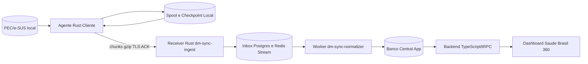
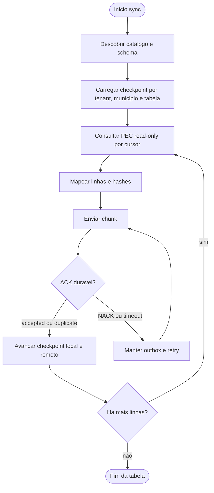
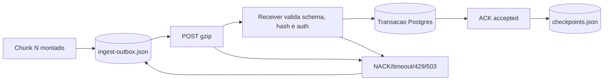
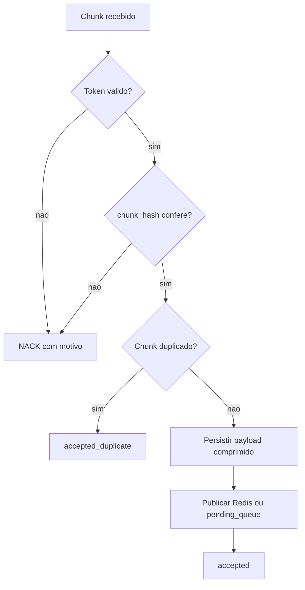
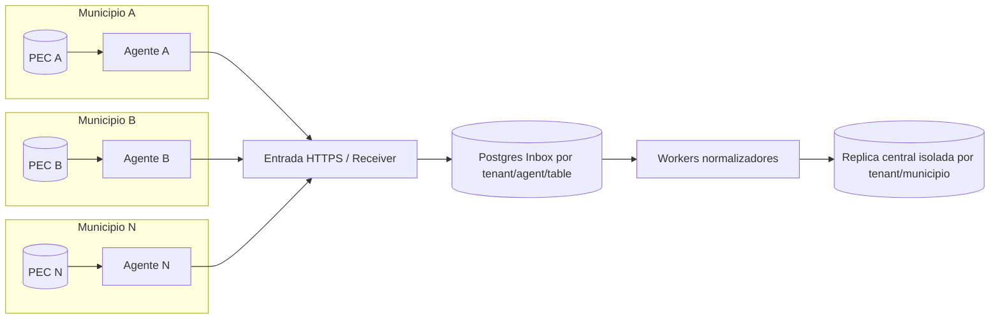
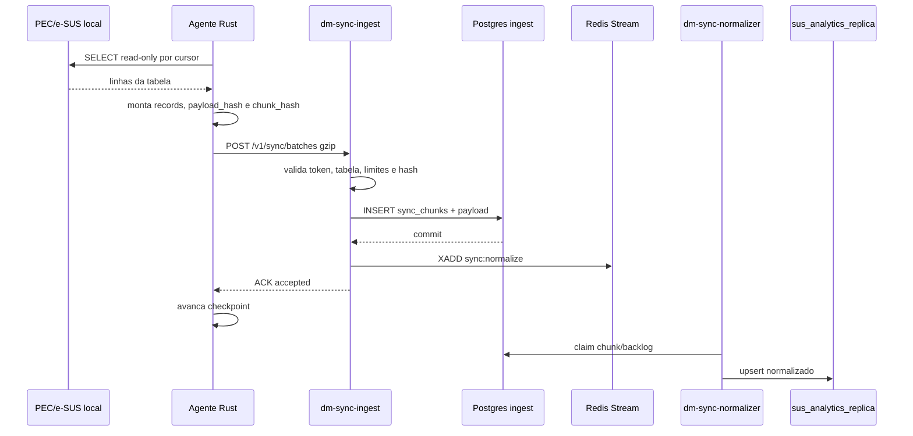
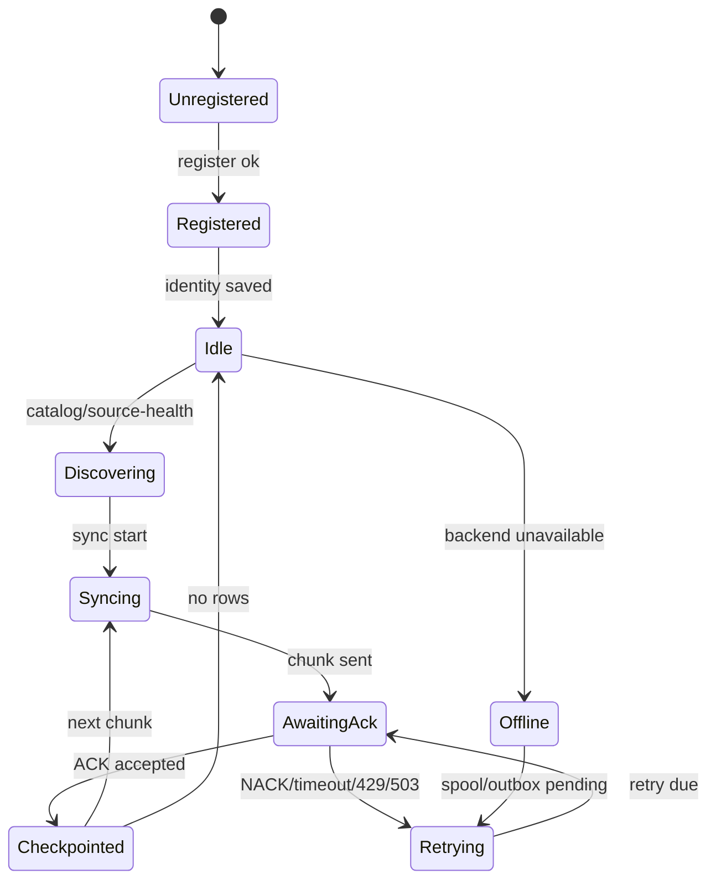
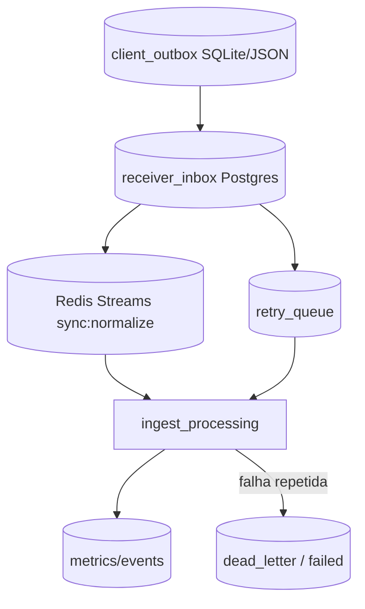
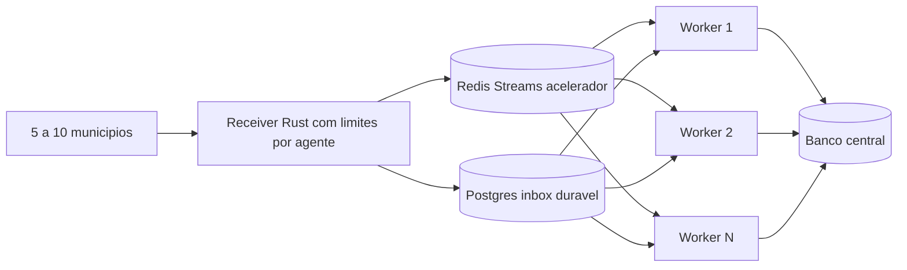
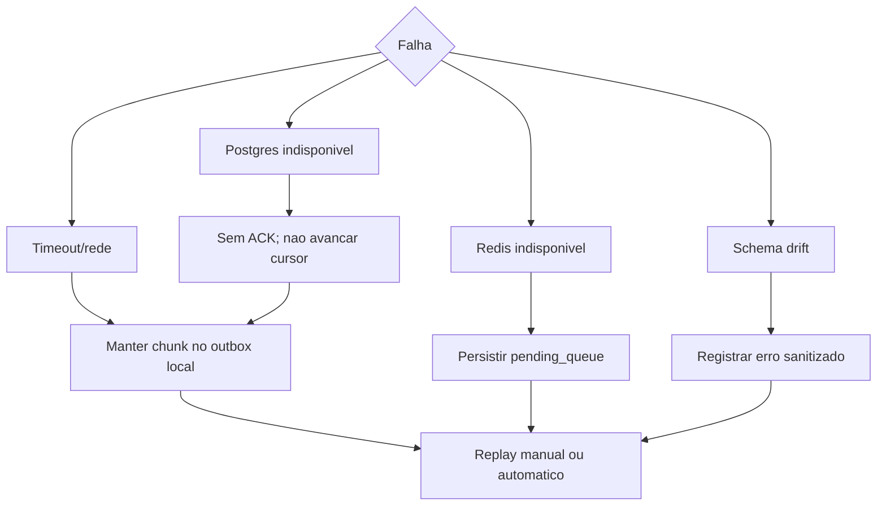

# Arquitetura Distribuida do Sync PEC/e-SUS

Data-alvo do artefato: 2026-05-31  
Auditoria executada em runtime local em: 2026-06-02  
Produto: SUS Analytics Sync / Saude Brasil 360

## Decisao executiva

O fluxo de sincronizacao distribuida ja possui implementacao real nas tres camadas centrais:

- `source`: agente cliente Rust em `Apps/agent/pec-agent-sync`.
- `source`: receiver Rust em `Apps/ingest/dm-sync-ingest`.
- `source/runtime`: backend TypeScript/Node em `Apps/server/api/src/agents/**`, `Apps/server/api/src/sync/**` e runtime `Apps/server/api/dist/index.js`.

O estado operacional nao deve ser declarado como "100% autonomo em servico" sem a correcao permanente da configuracao Windows. A evidencia de 2026-06-02 mostra:

- servico Windows `PecAgentSync`: `Running`;
- processo `pec-agent-sync`: presente;
- backend Docker: `healthy`, publicado em `127.0.0.1:3005`;
- `dm-sync-ingest`: `healthy`, `/readyz` com Postgres/migrations/Redis `ok`;
- `dm-sync-normalizer`: `healthy`;
- `/api/agents/summary` antes da correcao manual: `totalAgents=27`, `onlineAgents=0`, `totalBatchesLogged=7130`, `checkpointCount=61`;
- `/api/agents/summary` apos heartbeat manual com URL correta: `onlineAgents=1`;
- sync real controlado: `tb_fat_visita_domiciliar`, 500 linhas, `ackStatus=accepted`, `queueStatus=queued`, checkpoint `00000000000002098070 -> 00000000000002098570`.

Classificacao honesta: **BLOCKED_BY_AGENT_SERVICE_CONFIG** para operacao permanente do servico Windows. O runtime do agente foi validado manualmente com backend/receiver corretos, mas o NSSM/config instalado continua apontando para `3003` e a alteracao permanente exige permissao administrativa.

## Proveniencia dos achados

| Classe | Evidencia |
|---|---|
| `source` | `Apps/agent/pec-agent-sync/src/**`, `Apps/ingest/dm-sync-ingest/src/main.rs`, `Apps/server/api/src/agents/**`, `Apps/server/api/src/sync/**` |
| `runtime` | Windows service/process, `agent-state/**`, endpoints `http://127.0.0.1:3005/*`, `http://127.0.0.1:3015/*`, Docker healthchecks |
| `external-compose` | `docker/01-compose/compose.production.yml`, redes externas `dm-gov-saude` e `anton-infra` |
| `docs-context` | `README.md`, `arquivo de instruções do projeto`, `.github/AGENTS.md`, `regras de contribuição do projeto`, `docs/runbook.md`, `docs/architecture.md`, `docs/env.md`, `docs/06-sync-agent/**` |
| `generated-temp` | logs antigos em `logs/**`, snapshots de auditoria em scripts/results |
| `unknown-risk` | config instalada do servico aponta para `AGENT_SERVER_URL=http://127.0.0.1:3003`; tentativa de corrigir NSSM retornou `OpenService(): Acesso negado` |

## Componentes reais

### Agente Rust cliente

| Item | Estado | Evidencia |
|---|---|---|
| Caminho | implementado | `Apps/agent/pec-agent-sync` |
| Binario | implementado | `Cargo.toml` declara binario `pec-agent-sync` |
| Modos | implementado | `bootstrap`, `register`, `heartbeat`, `once`, `daemon`, `sync`, `health`, `catalog`, `collect`, `status`, `discover`, `diagnose-pec` |
| Daemon | implementado | `daemon.rs` com loop, heartbeat, source-health e flush de spool |
| Servico Windows | runtime parcial | `PecAgentSync Running`, `StartMode=Auto`, `ProcessId=5812`, `PathName="C:\Program Files\DMTech\esus-agent-sync\nssm.exe"` |
| Identidade | implementado | `identity.json`, `agent_id`, `installation_id`, `tenant_id`, `municipality_ids` |
| Enrollment | implementado | `AGENT_ACTIVATION_CODE`, `AGENT_ACCEPT_TERMS=true`, server token retornado no register |
| Checkpoint | implementado/runtime | `checkpoints.json`; 46 cursores no estado de `Apps/agent/pec-agent-sync`, 11 no estado raiz |
| Spool local | implementado/runtime vazio | `spool.json` com `entries=[]` |
| Ingest outbox | implementado/runtime vazio no estado raiz | `ingest-outbox.json` com `entries=[]`; ausente no estado de `Apps/agent/pec-agent-sync` |
| Heartbeat | implementado/runtime validado manualmente | HTTP 200, `accepted=true`, `/api/agents/summary onlineAgents=1` apos override para `3005` |
| Retry | implementado | spool com backoff exponencial; ingest outbox mantem falhas |
| Compressao | implementado | `Content-Encoding: gzip` no transporte ingest |
| Criptografia transporte | parcial | `reqwest` usa `rustls-tls`, mas URL local pode ser HTTP; producao deve usar TLS |
| HMAC/mTLS | ausente | codigo valida bearer/token hash; nao ha mTLS nem HMAC por chunk |

### Receiver Rust servidor

| Item | Estado | Evidencia |
|---|---|---|
| Caminho | implementado | `Apps/ingest/dm-sync-ingest` |
| Porta | implementado/runtime | `INGEST_PORT=3015`, host `127.0.0.1:3015` |
| Protocolo | implementado | `POST /v1/sync/batches` com gzip JSON |
| Health/readiness | implementado/runtime | `/healthz={"status":"ok"}`, `/readyz` status `ok` |
| Auth | implementado | bearer token validado contra `agent_registry.token_hash`; dev mode controlado por env |
| Persistencia | implementado | `sus_analytics_ingest.sync_runs`, `sync_table_state`, `sync_chunks`, `sync_chunk_payloads`, `sync_pending_queue` |
| ACK | implementado | `accepted` e `accepted_duplicate` apos persistencia duravel |
| NACK | implementado | `400`, `401`, `413`, `429`, `503` com motivo sanitizado |
| Backpressure | implementado | semaforos globais e por agente; `retry-after: 30` |
| Metricas | implementado/runtime | `/metrics`, `ingest_pending_queue_total 0` |
| Redis queue | implementado/runtime | Redis `sync:normalize`, readiness `redis=ok` |

### Backend TypeScript

| Item | Estado | Evidencia |
|---|---|---|
| Registro/heartbeat | implementado | `POST /api/agents/register`, `/heartbeat`, `/source-health` |
| Batch legado | implementado | `POST /api/agents/batch` com `AGENT_BATCH_MAX_ROWS` |
| Checkpoints remotos | implementado | `GET/POST /api/agents/checkpoint` |
| Status | implementado/runtime | `/api/agents/summary`, `/api/agents/list`, `/api/agents/status` |
| Readiness | implementado/runtime | `/readyz` com `syncCatalog.catalogStatus=ok` |
| Indicadores | implementado fora do escopo desta entrega | `saudeBrasil360.*` usa replica/catalogo para calculo; nao alterado aqui |
| Worker normalizador | implementado/runtime | `dm-sync-normalizer` consome Redis/backlog Postgres e chama `ingestAcsBatch` |

### Banco central/app

| Area | Estado | Evidencia |
|---|---|---|
| Agent registry | implementado | `agent_registry`, `agent_heartbeats`, `agent_source_health`, `agent_checkpoints`, `agent_batches`, `agent_events` |
| Ingest duravel | implementado | schema `sus_analytics_ingest` no receiver |
| Catalogo de sync | implementado/runtime | `sus_analytics_replica.sync_catalog_status`, `/readyz.syncCatalog` |
| Idempotencia | implementado parcial | `chunk_id`, `chunk_hash`, unique `(tenant_id, agent_id, source_table, chunk_start_cursor, chunk_end_cursor, chunk_hash)` |
| Tenant/municipio | implementado parcial | `tenant_id`, `agent_id`, `municipality_id`; isolamento logico depende de uso consistente no destino |

## Arquitetura macro

## Fluxo incremental

## Chunking, checkpoint e retry

## ACK, NACK e idempotencia

## Distribuicao multi-municipio

## Sequencia cliente para banco central

## Estados do agente

## Modelo de filas

## Escalabilidade inicial

## Recuperacao de falha

## Estrategia alvo

### Chunking

- Checkpoint por `tenant_id`, `agent_id`, `municipality_id`, `source_table`, cursor e chunk.
- Chunk por range de PK quando a tabela tem chave monotona.
- Janela temporal somente quando houver coluna temporal confiavel.
- Fallback por cursor estavel e ordenado.
- Tamanho inicial: tabelas pequenas em chunk unico; medias entre 5k e 20k linhas; grandes entre 10k e 50k linhas, respeitando limites do receiver.
- Limite operacional atual do receiver: `INGEST_MAX_RECORDS_PER_CHUNK=5000`, `INGEST_MAX_COMPRESSED_BYTES=10MB`, `INGEST_MAX_UNCOMPRESSED_BYTES=50MB`.

### Filas

Modelo recomendado:

- cliente: outbox local duravel, idealmente SQLite no instalador de campo; hoje existe JSON (`spool.json`, `ingest-outbox.json`);
- servidor: Postgres como fonte da verdade (`sync_chunks`, `sync_chunk_payloads`, `sync_pending_queue`);
- Redis Streams como acelerador de processamento;
- DLQ para chunks com falha repetida e replay manual.

Entrega sem perda de dados: **at-least-once delivery** com **exactly-once effect** por idempotencia.

### Idempotencia

- Por chunk: `chunk_id` + `chunk_hash` + unique `(tenant_id, agent_id, source_table, chunk_start_cursor, chunk_end_cursor, chunk_hash)`.
- Por linha: `source_key`, `payload_hash`, `operation`, `observed_at`.
- No destino: upsert deterministico por tenant/tabela/chave primaria ou hash quando nao houver updated_at.
- Delecoes: ainda dependem de regra por tabela; quando PEC nao expuser marcador claro, usar reconciliacao periodica.

### Observabilidade

Obrigatorio manter:

- `GET /api/health`, `GET /readyz` no backend;
- `GET /healthz`, `GET /readyz`, `GET /metrics` no receiver;
- logs estruturados com `request_id`/`correlationId`;
- metricas de chunks, bytes, latencia, fila pendente, retry e DLQ;
- status por tabela no `sync_catalog_status`.

### Seguranca

- PEC sempre read-only.
- Nao criar tabela no PEC.
- Nao logar CPF/CNS completos, nome, senha, token ou connection string.
- Autenticacao atual por bearer token com hash SHA-256 em `agent_registry.token_hash`.
- Produção deve exigir TLS; mTLS/HMAC por chunk ainda nao esta implementado.
- Spool local deve ser criptografado no instalador de campo se o host puder ser compartilhado.

## Lacunas objetivas

| Lacuna | Impacto | Proxima correcao |
|---|---|---|
| Backend mostra `onlineAgents=0` | Nao declarar agente conectado | validar URL do servico Windows e heartbeat para porta/publicacao correta |
| `scripts/11-windows/agent-service-status.ps1` falhou ao chamar `.StartTime.ToString()` em valor nulo | Script de status fragil | ajustar script para tolerar processo sem StartTime exposto |
| mTLS/HMAC ausentes | Autenticacao depende de bearer token | projetar assinatura por chunk ou mTLS em rollout de producao |
| outbox JSON | Risco em volume alto/local multiusuario | migrar para SQLite com criptografia e fsync controlado |
| opcionais descobertas sem `lastSyncedAt` | Catalogo conhece tabelas mas nao sincronizou todas | priorizar opcionais conforme indicador/CVAT que exigir |
