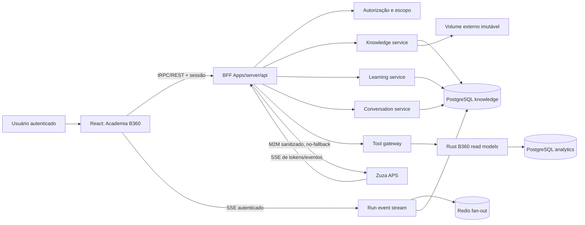

# Plano de implementação — Academia PEC & Saúde Brasil 360

**Data:** 2026-08-01

**Status:** `PLANNING_COMPLETE_IMPLEMENTATION_NOT_STARTED`

**Produto alvo:** e-SUS APS 360

**Rota principal:** `/saude-brasil-360`
**Escopo:** biblioteca normativa, chat Zuza APS com citações, cursos, progresso, quizzes, análise municipal, diagnóstico individual autorizado e administração do módulo.

## 1. Resultado esperado

Transformar a página operacional atual de Saúde Brasil 360 em uma experiência educacional e assistiva semelhante ao NotebookLM, mantendo o e-SUS APS 360 como autoridade de identidade, tenant, município, permissões, conversas, progresso e auditoria.

A solução deve:

- responder somente com base em fontes versionadas, verificáveis e autorizadas;
- apresentar citações navegáveis até página, seção e trecho da fonte;
- usar o Zuza APS apenas como motor de geração e streaming, por integração servidor-a-servidor;
- manter os cálculos e fatos dos indicadores sob autoridade do runtime Rust;
- nunca inventar conteúdo, dados municipais, justificativas ou evidências individuais;
- separar claramente conteúdo normativo, dados agregados municipais e diagnóstico individual sensível;
- preservar o painel operacional atual em uma página administrativa protegida;
- entregar cursos, progresso, quizzes, histórico, notas e trilhas por indicador;
- falhar de forma explícita quando uma fonte, permissão, versão, integração ou materialização real estiver indisponível.

## 2. Baseline auditada

### 2.1 Repositório e estado de trabalho

- Repositório: `devdudumuniz/esus-analytics`.
- Branch: `main`.
- HEAD auditado: `75739dd3e3ef49c663d1d2b2b0fcfcc31013a611` (`fix: keep B360 dashboard on Rust authority`).
- O working tree contém WIP extenso e não relacionado a este plano. Nenhum arquivo existente deve ser limpo, revertido, sobrescrito ou incluído automaticamente em commits da funcionalidade.
- O plano adiciona somente este documento; a implementação deve começar em branch própria depois da reconciliação do WIP.

### 2.2 Stack e autoridades atuais

| Camada | Autoridade vigente | Decisão para a Academia |
|---|---|---|
| Frontend | React, Vite, Tailwind, shadcn em `Apps/web/client` | Manter; criar feature modular e rotas próprias |
| BFF/API | Express + tRPC em `Apps/server/api` | Único backend web da Academia |
| Indicadores | Rust + read model materializado | Preservar como autoridade exclusiva de fatos e cálculos |
| Banco | PostgreSQL compartilhado | Criar schemas/tabelas versionadas, sem novo banco no compose |
| Estado transitório | Redis compartilhado | Usar somente para fan-out, filas e locks; PostgreSQL é durável |
| Serviço de apoio externo | Integração opcional fora do app | Gateway M2M com escopo mínimo; nunca chamado pelo navegador |
| Fontes | PDFs e manifesto oficial versionado | Ingestão imutável, hash obrigatório e publicação curada |
| Arquivos | Ainda sem object storage compartilhado confirmado | MVP em volume externo configurável; MinIO é evolução opcional |

### 2.3 Situação dos componentes relevantes

| Componente | Situação | Evidência e consequência |
|---|---|---|
| Página `/saude-brasil-360` | Implementada como console operacional | Será substituída apenas quando a flag da Academia estiver ativa |
| Endpoints REST `/api/b360/*` | Implementados, com consumidores atuais e alguns fallbacks | Não remover; migrar uso administrativo, autenticar e eliminar representação enganosa de zeros |
| `AIChatBox.tsx` | Parcial, apenas visual, sem persistência/citações/backend | Não serve como base de contrato; pode inspirar somente componentes visuais |
| `módulo legado de integração` | Legado/orfão e fora do backend canônico | Não reutilizar |
| B360 read model | Implementado com autoridade Rust | Reutilizar para análise agregada, sempre com escopo derivado da sessão |
| Escopo autorizado B360 | Implementado, porém centrado em uma associação por usuário | Evoluir com migração compatível se múltiplos municípios forem necessários |
| Fontes oficiais | Manifesto forte com URL, tamanho e SHA-256 | Tornar o manifesto a autoridade de versão da ingestão |
| PDFs locais B1–B6/C1–C7/M1–M2 | Divergem do manifesto oficial atual | Classificar como históricos; não publicar como norma vigente |
| NT CVAT | Hash local compatível com o manifesto | Elegível para ingestão depois da validação do pipeline |
| Retrieval do `dm-notebook` | BM25, empacotamento e CitationGuard reais | Adaptar algoritmos e contratos, não copiar storage/aplicação |
| Zuza API keys | Reais, mas sem escopos de serviço granulares | Bloqueia produção até existir credencial M2M least-privilege |
| Streaming Zuza | SSE real | Reutilizável somente por rota dedicada, sem fallback silencioso |
| Evidência por cidadão/regra | Não materializada pelo Rust | Bloqueia `explain_not_counted` individual até novo read model pseudonimizado |
| Runtime eSUS | Container auditado reiniciando por falha no banco analítico | Pré-condição operacional para smoke integrado, não mudança deste planejamento |
| PostgreSQL `vector` | Extensão indisponível no host auditado | MVP sem pgvector; não alegar busca semântica vetorial |

## 3. Princípios não negociáveis

1. Nenhuma resposta factual sem evidência recuperada e versionada.
2. Nenhuma citação sem trecho verificável na versão imutável da fonte.
3. Nenhum cálculo oficial ou justificativa de indicador reimplementado em TypeScript.
4. Nenhum acesso a tenant ou município recebido como autoridade do navegador.
5. Nenhum dado pessoal bruto enviado ao Zuza, gravado em logs ou indexado na base de conhecimento.
6. Nenhum fallback de modelo, fonte, banco ou resultado apresentado como sucesso.
7. Nenhum curso publicado automaticamente a partir de conteúdo externo.
8. Nenhuma permissão nova herdada implicitamente por todos os perfis administrativos.
9. Nenhum novo PostgreSQL, Redis ou cache dentro do compose da aplicação.
10. Toda ativação deve ser reversível por flag e não pode interromper o painel legado.

## 4. Arquitetura alvo



### 4.1 Fronteiras de responsabilidade

**Frontend**

- renderiza biblioteca, chat, curso, quiz, progresso, análise e administração;
- nunca chama Zuza, banco, armazenamento ou read model diretamente;
- envia apenas intenção do usuário e identificadores opacos emitidos pelo servidor;
- não escolhe tenant, município, perfil, versão normativa ou permissão efetiva.

**BFF/API TypeScript**

- autentica sessão e resolve tenant/município no servidor;
- aplica RBAC específico da Academia;
- coordena retrieval, ferramentas reais, política de citações e streaming;
- persiste conversas, runs, eventos, citações, progresso e auditoria;
- não recalcula indicadores oficiais.

**Rust**

- continua como autoridade de resultados agregados e sua linhagem;
- passa a produzir, em etapa separada, evidência materializada por sujeito pseudonimizado para diagnóstico individual;
- mantém regras, versões, janelas, critérios, elegibilidade e reason codes.

**Zuza APS**

- recebe contexto mínimo já autorizado e sanitizado;
- gera a resposta em streaming sob perfil de agente versionado;
- não é autoridade de sessão, tenant, progresso, fonte ou cálculo;
- não persiste memória conversacional deste produto;
- não executa ferramentas genéricas de código, SSH, sandbox ou tarefas para a Academia.

## 5. Estrutura de código proposta

```text
Apps/server/api/src/features/b360-academy/
  router.ts
  permissions.ts
  scope.ts
  contracts/
  repositories/
  knowledge/
    ingestion/
    extraction/
    retrieval/
    citations/
  conversations/
  learning/
  tools/
  zuza/
  observability/
  migrations/

Apps/web/client/src/features/b360-academy/
  api/
  components/
  pages/
  hooks/
  state/
  tests/

Apps/ingest/src/... ou crate Rust de regras existente
  b360_subject_evidence/

docs/13-saude-brasil-360/academy/
  architecture.md
  content-governance.md
  source-ingestion-runbook.md
  zuza-m2m-contract.md
  lgpd-threat-model.md
  rollout-runbook.md
```

O router `b360Academy` será montado no app router canônico. Não criar implementação paralela em `Apps/web/server`.

## 6. Modelo de dados

Criar schema dedicado, sugerido como `sus_analytics_knowledge`, usando migrations SQL versionadas, reversíveis e revisáveis. As migrations não devem rodar silenciosamente no startup: uma checagem de prontidão deve indicar `MIGRATIONS_PENDING` até a execução operacional autorizada.

### 6.1 Fontes e conhecimento

**`knowledge_sources`**

- `id`, `tenant_id` anulável apenas para fonte nacional;
- `source_key`, `title`, `source_type`, `authority`, `official_url`;
- `indicator_codes[]`, `scope_type`, `language`;
- `status`: `draft`, `verified`, `published`, `superseded`, `revoked`, `quarantined`;
- `created_by`, `created_at`, `updated_at`.

**`knowledge_source_versions`**

- `id`, `source_id`, `version_label`, `effective_from`, `effective_to`;
- `manifest_sha256`, `binary_sha256`, `byte_size`, `mime_type`;
- `storage_key`, `fetched_at`, `verified_at`, `verified_by`;
- `supersedes_version_id`, `revocation_reason`;
- unicidade por fonte e hash.

**`knowledge_chunks`**

- `id`, `source_version_id`, `chunk_index`;
- `page_start`, `page_end`, `section_path`, `heading`;
- `text`, `normalized_text`, `char_start`, `char_end`;
- `content_sha256`, `token_count`;
- `search_vector` gerado para PostgreSQL FTS;
- `classification` e `contains_sensitive_data=false` como requisito de publicação.

**`knowledge_ingestion_runs`** e **`knowledge_ingestion_events`**

- estado e evidência de download, hash, MIME, extração, OCR eventual, chunking, indexação e publicação;
- idempotency key, contagens, erros estruturados e tempos;
- nunca registram o corpo integral do documento no log.

### 6.2 Conversas, runs e citações

**`assistant_threads`**

- `id`, `tenant_id`, `municipality_id`, `user_id`, `title`, `status`;
- `agent_profile_version`, `knowledge_snapshot_id`;
- datas de criação, atualização e arquivamento.

**`assistant_messages`**

- `id`, `thread_id`, `role`, `content_redacted`, `content_sha256`;
- `run_id`, `sequence`, `created_at`;
- política de retenção e exclusão por usuário/tenant.

**`assistant_runs`**

- `id`, `thread_id`, `status`, `request_id`, `idempotency_key`;
- `query_redacted`, `agent_profile_version`, `knowledge_snapshot_id`;
- `zuza_request_id`, métricas de tempo/tokens, erro seguro;
- `started_at`, `completed_at`, `cancelled_at`.

**`assistant_run_events`**

- `run_id`, `event_id` monotônico, `event_type`, `payload_safe`, `created_at`;
- suporta replay por `Last-Event-ID` e reconexão SSE.

**`assistant_citations`**

- `message_id`, `ordinal`, `source_id`, `source_version_id`, `chunk_id`;
- `page_start`, `page_end`, `section_path`, `quote`, `quote_sha256`;
- offsets exatos, score de retrieval, método de validação e `verified=true`.

**`assistant_tool_calls`**

- nome/versão da ferramenta, argumentos sanitizados ou seus hashes;
- escopo efetivo, read-model version, status, latência e resposta sanitizada;
- sem identificadores civis brutos.

### 6.3 Aprendizagem

**`learning_tracks`**

- trilhas iniciais: B1–B6, C1–C7, M1–M2; CVAT permanece biblioteca/tópico até aprovação de uma trilha própria;
- título, objetivo, indicador, versão normativa, status editorial e ordem.

**`learning_modules`**, **`learning_lessons`**, **`learning_lesson_sources`**

- conteúdo estruturado, duração estimada, pré-requisitos e fontes obrigatórias;
- cada afirmação normativa relevante deve apontar para citações verificadas;
- estados `draft`, `in_review`, `published`, `superseded`.

**`learning_enrollments`**, **`learning_progress`**

- sempre com `tenant_id`, `municipality_id`, `user_id`;
- percentual derivado de unidades concluídas, não editável pelo cliente;
- checkpoints idempotentes e trilha de auditoria.

**`quiz_questions`**, **`quiz_options`**, **`quiz_attempts`**, **`quiz_answers`**

- questões versionadas e ligadas a fontes;
- correção no servidor;
- tentativas e respostas isoladas por usuário e tenant;
- nunca enviar resposta correta antes da submissão.

**`user_notes`** e **`bookmarks`**

- ownership obrigatório por usuário/tenant;
- referência opcional a fonte, página, lição, thread ou mensagem;
- exclusão lógica e política de retenção.

### 6.4 Evidência individual sob autoridade Rust

Criar migration separada no domínio analítico para **`indicator_subject_evaluations`**:

- `tenant_id`, `municipality_id`, `scope_id`;
- `indicator_code`, `rule_version`, `schema_version`, `competence` e janela;
- `subject_ref`: HMAC/identificador opaco rotacionável, sem CPF, CNS, nome ou prontuário;
- elegibilidade e denominador;
- resultados por critério, reason codes, timestamps relevantes já minimizados;
- source lineage, freshness, calculation run e hash de integridade;
- retenção curta e limpeza versionada.

Essa tabela é produzida pelo Rust no mesmo ciclo das materializações oficiais. O TypeScript apenas consulta. Enquanto ela não existir para um indicador, a ferramenta deve retornar `SUBJECT_EVIDENCE_NOT_AVAILABLE`.

## 7. Ingestão e governança de fontes

### 7.1 Pipeline

1. Ler o manifesto oficial aprovado do repositório.
2. Baixar por HTTPS com allowlist de domínios e limite de tamanho.
3. Validar MIME real, byte size e SHA-256 antes de persistir.
4. Armazenar binário imutável em volume externo configurado por `B360_KNOWLEDGE_STORAGE_ROOT`.
5. Extrair texto página a página com biblioteca que preserve número de página, preferencialmente `pdfjs-dist`.
6. Detectar página vazia/escaneada; OCR é job explícito e auditado, nunca fallback silencioso.
7. Normalizar texto preservando offsets, títulos e hierarquia de seções.
8. Aplicar classificação de sensibilidade e scanner de CPF, CNS, CNPJ, e-mail, telefone, nomes/caminhos privados e segredos.
9. Gerar chunks page-aware e hashes.
10. Indexar em transação; manter versão anterior publicada até a nova versão passar nos gates.
11. Executar testes de citações douradas e revisão humana.
12. Publicar atomicamente um `knowledge_snapshot`.

### 7.2 Situação inicial das fontes

- Os 15 PDFs metodológicos locais B1–B6, C1–C7 e M1–M2 não correspondem aos hashes mais recentes do manifesto e não podem ser publicados como fonte normativa vigente.
- A NT de CVAT auditada corresponde ao manifesto e pode ser o primeiro caso de validação end-to-end.
- O primeiro job real deve baixar as versões oficiais, validar os hashes e registrar as cópias locais antigas como `superseded` ou `historical`, sem apagá-las.
- Divergência de hash, redirecionamento inesperado, MIME inválido ou URL indisponível resulta em quarentena, não em ingestão parcial.

### 7.3 Storage

- MVP: volume bind externo ao repositório, em diretório dedicado sob a política operacional de `E:\databases\volumes\`, com caminho final validado antes da criação.
- O compose somente monta o volume; não persiste PDFs dentro do Git.
- Backup, ACL e retenção são pré-condições da publicação.
- MinIO pode substituir a implementação do storage por adapter no futuro, se for provisionado no `anton-infra`; não criar MinIO neste projeto.

## 8. Retrieval e CitationGuard

### 8.1 Estratégia MVP

Como `pgvector` não está disponível no PostgreSQL auditado, o MVP será uma busca lexical híbrida honesta:

1. PostgreSQL Full Text Search com configuração `simple` para recall inicial;
2. filtros obrigatórios por snapshot publicado, vigência, indicador e visibilidade;
3. boosts exatos para códigos como `C2`, `C3`, `B5`, termos SIGTAP, CBO e expressões normativas;
4. reranking BM25 no backend, adaptado do `dm-notebook`;
5. diversidade por fonte/página e limite de contexto;
6. resposta abstida quando a evidência recuperada for insuficiente.

Não rotular essa etapa como busca semântica. Vetores são uma evolução futura condicionada à aprovação de infraestrutura, extensão e modelo de embeddings com governança.

### 8.2 Contrato de citação

Toda citação deve conter:

- fonte e versão imutável;
- página inicial/final e caminho de seção;
- trecho textual curto;
- offsets e hash do trecho;
- link interno ao visualizador no ponto correto;
- status de verificação.

O CitationGuard deve:

- rejeitar citação cujo trecho não exista na versão apontada;
- validar por offsets exatos e hash, não somente por sobreposição lexical;
- separar afirmações factuais do texto gerado e exigir suporte suficiente;
- reescrever/remover afirmações não suportadas;
- abortar a resposta se a reescrita ainda deixar alegações normativas sem fonte;
- registrar reason codes como `NO_EVIDENCE`, `VERSION_CONFLICT`, `QUOTE_MISMATCH` e `INSUFFICIENT_SUPPORT`.

### 8.3 Conflito de fontes

Ordem de autoridade:

1. fonte oficial vigente e verificada pelo manifesto;
2. ato oficial complementar vigente;
3. material municipal curado, apenas para contexto local;
4. conteúdo educacional derivado, sempre apontando para as fontes acima.

Se duas fontes oficiais vigentes conflitarem, a resposta não escolhe silenciosamente: informa o conflito, mostra ambas, registra `SOURCE_CONFLICT` e encaminha para curadoria.

## 9. Integração Zuza APS M2M

### 9.1 Diagnóstico

O Zuza Core possui API keys e streaming SSE reais, mas as chaves atuais herdam acesso amplo de usuário e podem alcançar rotas de chat, agente, código, SSH, sandbox e tarefas. Esse contrato não atende ao menor privilégio necessário.

### 9.2 Mudanças obrigatórias no `zuza-code`

Implementar em branch/PR independente, sugerida como `DM Technology/zuza-b360-knowledge-m2m-20260801`:

- credencial de serviço distinta de API key humana;
- tabela de `service_accounts`/`service_credentials` com tenant, application e scopes explícitos;
- scope exclusivo, por exemplo `knowledge.chat.stream`;
- rota dedicada ao B360 ou middleware que negue todas as demais rotas;
- `fallback_allowed=false` obrigatório e rejeitado se omitido;
- perfil de agente e versão explícitos;
- modo efêmero sem memória/RAG próprio do Zuza;
- limite de tamanho, timeout, cancelamento e idempotência;
- auditoria por request-id sem prompt bruto;
- rotação/revogação de segredo e health/readiness do provider;
- testes negativos provando que a credencial não acessa code, SSH, sandbox, tasks, admin ou agentes genéricos.

### 9.3 Contrato do eSUS para o Zuza

O BFF envia apenas:

- consulta sanitizada;
- contexto recuperado com IDs opacos, citações candidatas e limites;
- resultados sanitizados de ferramentas já autorizadas;
- idioma, perfil `zuza-aps` e versões;
- política `no_fallback`, formato de saída e request-id.

O Zuza não recebe cookie de sessão, JWT humano, CPF, CNS, nome, prontuário, IDs internos reversíveis, hostnames privados ou credenciais de banco.

## 10. Conversas e streaming

### 10.1 Fluxo

1. `POST /api/b360/academy/runs` autentica, autoriza, persiste run e devolve `runId`.
2. O backend recupera contexto e ferramentas, valida sensibilidade e chama Zuza M2M.
3. `GET /api/b360/academy/runs/:runId/events` abre SSE autenticado.
4. Eventos são persistidos no PostgreSQL e publicados pelo Redis para baixa latência.
5. Reconexão usa `Last-Event-ID`; o cliente nunca perde a resposta já persistida.
6. Cancelamento marca o run e propaga abort ao Zuza.
7. Mensagem final somente vira `completed` depois do CitationGuard.

### 10.2 Eventos mínimos

- `run.started`;
- `retrieval.completed` com contagens, não conteúdo sensível;
- `tool.started` e `tool.completed` sanitizados;
- `message.delta`;
- `citations.verified`;
- `message.completed`;
- `run.failed`, `run.cancelled` e heartbeat.

## 11. Ferramentas reais do agente

### 11.1 `search_knowledge`

- busca apenas snapshots publicados e autorizados;
- filtros por indicador, tipo, vigência e fonte;
- devolve chunks page-aware e scores;
- acesso via permissão `knowledge.b360.read`.

### 11.2 `get_indicator_methodology`

- resolve o indicador para a fonte normativa vigente;
- devolve critérios, versão e citações, nunca cálculo refeito;
- falha com `METHODOLOGY_NOT_PUBLISHED` quando a fonte não passou pela curadoria.

### 11.3 `analyze_municipality`

- consulta o read model Rust agregado existente;
- usa tenant/município/equipe derivados do servidor;
- devolve competência, freshness, regra, lineage e reason codes;
- nunca transforma ausência de dado em zero.

### 11.4 `explain_not_counted`

- exige `knowledge.b360.diagnostics.read` e escopo operacional compatível;
- aceita somente `subject_ref` opaco emitido por busca autorizada no próprio eSUS;
- consulta a materialização Rust individual;
- devolve critérios atendidos/não atendidos, evidência mínima e atualização da fonte;
- nunca mostra dados de outra pessoa, CPF, CNS, nome ou payload clínico bruto;
- permanece bloqueada por indicador até existir materialização real e testes LGPD.

## 12. RBAC e isolamento

### 12.1 Permissões

- `knowledge.b360.read` — biblioteca e cursos publicados;
- `knowledge.b360.ask` — chat normativo;
- `knowledge.b360.progress.write` — progresso, quiz e notas próprias;
- `knowledge.b360.admin` — fontes, ingestão, conteúdo e configuração;
- `knowledge.b360.diagnostics.read` — diagnóstico individual sensível;
- `knowledge.b360.audit.read` — auditoria operacional, se necessária.

Criar um procedimento de autorização específico da Academia. Não reutilizar uma regra que dê bypass automático a qualquer `admin` ou `super_admin`; os grants devem ser explícitos no registry e revisados por perfil.

### 12.2 Regras de escopo

- `tenant_id`, `municipality_id` e `user_id` são derivados da sessão autenticada;
- cada query de dados do usuário inclui os três filtros quando aplicáveis;
- chaves e FKs compostas impedem associação cruzada acidental;
- repositórios não aceitam tenant arbitrário como argumento público;
- fontes nacionais são globais somente após publicação; fontes municipais pertencem ao tenant;
- diagnóstico individual exige interseção entre permissão, município, equipe/unidade autorizada e finalidade registrada;
- testes de negação cross-tenant são obrigatórios para toda entidade.

RLS no PostgreSQL é hardening recomendado, condicionado à auditoria do usuário/role de conexão e de pooling. O isolamento no backend é obrigatório independentemente de RLS.

## 13. Experiência web

### 13.1 Página principal `/saude-brasil-360`

- cabeçalho “Academia PEC & Saúde Brasil 360”;
- busca global em fontes, aulas e conversas;
- painel “Pergunte ao Zuza APS” com sugestões seguras;
- trilhas por indicador com estado editorial e progresso real;
- biblioteca com filtros por indicador, vigência, tipo e autoridade;
- análises municipais somente para perfis autorizados;
- histórico, notas e itens salvos do usuário;
- estado vazio ou bloqueado explícito quando algo não estiver disponível.

### 13.2 Chat

- streaming com cancelamento/reconexão;
- citações inline numeradas e painel lateral de fontes;
- visualizador de PDF na página citada;
- indicadores de “fonte vigente”, “histórica”, “conflito” e freshness;
- feedback de utilidade sem alterar fatos;
- nenhum texto “analisando dados reais” antes da conclusão da ferramenta.

### 13.3 Cursos e quizzes

- 15 trilhas iniciais B1–B6, C1–C7 e M1–M2 criadas como `draft`;
- liberar apenas lições revisadas e ligadas a fontes vigentes;
- retomada por usuário, progresso idempotente e quiz corrigido no servidor;
- quando uma norma mudar, congelar a versão antiga e pedir revalidação editorial da trilha.

### 13.4 Administração

Mover o console operacional atual para rota sugerida:

`/configuracoes/saude-brasil-360`

A página administrativa deve incluir:

- status PEC/analytics e agentes;
- fontes, versões, hashes e ingestões;
- snapshots publicados;
- perfil/versionamento do agente Zuza APS;
- fila de conflitos/citações inválidas;
- saúde do M2M e métricas, sem segredos;
- gestão editorial de cursos e quizzes.

Durante a migração, manter os endpoints atuais e mapear todos os consumidores antes de autenticar/remover fallbacks. A rota antiga continua servindo o painel atual quando `B360_ACADEMY_ENABLED=false`.

## 14. Feature flags e configuração

Flags padrão `false`:

- `B360_ACADEMY_ENABLED`;
- `B360_KNOWLEDGE_INGESTION_ENABLED`;
- `B360_ZUZA_ENABLED`;
- `B360_SUBJECT_DIAGNOSTICS_ENABLED`.

Configurações adicionais:

- storage root e limites;
- URL interna do Zuza e referência ao segredo M2M;
- timeouts, budgets e limites de contexto;
- retenção de conversa/eventos/auditoria;
- allowlist de fontes;
- versão do manifesto e do agente.

Segredos ficam fora do Git e não aparecem na UI, em logs ou respostas de health.

## 15. Segurança, LGPD e threat model

### 15.1 Controles mínimos

- classificação de dados por entidade/campo;
- minimização e propósito registrado para ferramentas sensíveis;
- TLS/rede interna para eSUS → Zuza;
- criptografia/ACL do volume de fontes e backups;
- redaction incluindo CPF, CNS, CNPJ, e-mail, telefone, tokens, caminhos internos e padrões clínicos proibidos;
- prompts e tool results sanitizados antes do M2M;
- auditoria imutável de acesso a diagnóstico;
- proteção CSRF/origin para criação de run e SSE;
- rate limit por usuário/tenant/IP e limites de custo;
- prevenção de prompt injection em fontes: texto recuperado é evidência não executável;
- downloads com SSRF protection, allowlist, DNS/IP validation e limite de redirecionamentos;
- exclusão/exportação de dados pessoais conforme política aplicável.

### 15.2 Retenção sugerida para aprovação

- fontes normativas: enquanto vigentes + histórico de auditoria;
- conversas/notas: política configurável por tenant, com padrão explícito e exclusão pelo usuário;
- eventos de streaming: retenção curta após consolidação da mensagem;
- auditoria de acesso sensível: conforme política institucional/legal;
- evidência individual materializada: menor janela operacional possível, recalculável e sem identificador civil.

## 16. Observabilidade e operações

### 16.1 Logs e métricas

- logs JSON com `request_id`, `run_id`, tenant pseudonimizado, usuário pseudonimizado e versão;
- nunca prompt, resposta, trecho sensível ou segredo em log por padrão;
- métricas de ingestão, retrieval, abstention, CitationGuard, streaming, Zuza, tools e cursos;
- dashboards por taxa/latência/erro, sem conteúdo;
- alertas para hash divergente, CitationGuard fail-open, fonte expirada, cross-tenant deny, Zuza indisponível e fila parada.

### 16.2 Readiness

Adicionar componentes à prontidão da feature sem derrubar o app inteiro quando a Academia estiver desativada:

- migrations aplicadas;
- storage gravável/lível;
- snapshot publicado;
- Redis disponível para streaming;
- Zuza M2M disponível quando flag ativa;
- read models Rust frescos para ferramentas de dados.

Estados devem ser estruturados: `READY`, `DEGRADED`, `BLOCKED_BY_SOURCE`, `BLOCKED_BY_SCHEMA`, `BLOCKED_BY_PROVIDER`, `BLOCKED_BY_PERMISSION`.

## 17. Plano de execução por fases

As estimativas abaixo são de esforço de engenharia, não prazo fechado. Conteúdo/curadoria corre em trilha própria.

### Fase 0 — Reconciliação e baseline operacional — 3 a 5 dias

**Entregas**

- reconciliar o WIP atual sem revertê-lo;
- restaurar o runtime eSUS e provar `/healthz` e `/readyz` no container servido;
- confirmar role/database/schema de migrations e o diretório externo de storage;
- congelar matriz dos 21 indicadores e das 15 trilhas solicitadas;
- capturar baseline de permissões e consumidores de `/api/b360/*`.

**Gate:** working tree compreendido, runtime saudável, fontes/infra identificadas e nenhum segredo exposto.

### Fase 1 — ADRs, contratos e flags — 3 a 5 dias

**Entregas**

- ADR de autoridade Rust/BFF/Zuza;
- contratos de erro, citação, run/evento e tool;
- flags desativadas por padrão;
- módulos vazios reais, sem stub de sucesso;
- threat model e políticas de retenção para aprovação.

**Gate:** revisão arquitetural, segurança e produto aprovadas.

### Fase 2 — Schema e repositórios multi-tenant — 5 a 8 dias

**Entregas**

- migrations up/down para knowledge, conversation, learning e audit;
- repositórios com escopo derivado do servidor;
- idempotência, constraints e testes cross-tenant;
- migration readiness explícita.

**Gate:** migrations validadas em banco descartável e shared dev; rollback provado; zero tabela duplicada de infraestrutura.

### Fase 3 — Ingestão e biblioteca de fontes — 8 a 12 dias

**Entregas**

- manifest loader, downloader seguro, hash/MIME verification;
- storage adapter e extração page-aware;
- scanner de sensibilidade;
- chunks/FTS, snapshots e painel de ingestão;
- NT CVAT como piloto e depois as versões oficiais dos 15 indicadores.

**Gate:** 100% dos documentos publicados conferem com manifesto, páginas e hashes; documentos divergentes ficam em quarentena.

### Fase 4 — Retrieval e CitationGuard — 8 a 12 dias

**Entregas**

- FTS + BM25 + boosts de domínio;
- contratos page-aware adaptados do `dm-notebook`;
- validação exata de quote/offset/hash;
- conflito, abstention e suite de perguntas douradas.

**Gate:** nenhuma resposta de teste com afirmação normativa não suportada; métricas de recall e abstention aprovadas.

### Fase 5 — M2M least-privilege no Zuza — 6 a 10 dias, paralelizável

**Entregas**

- service credential escopada;
- rota streaming dedicada/no-fallback;
- rotação, auditoria e testes negativos;
- contrato versionado consumido pelo eSUS.

**Gate:** credencial B360 não acessa nenhuma rota fora do escopo; provider indisponível produz erro explícito.

### Fase 6 — Chat, persistência e streaming — 8 a 12 dias

**Entregas**

- threads, mensagens, runs e eventos;
- POST de run, SSE replay/cancelamento;
- retrieval + Zuza + CitationGuard;
- histórico, rename/archive/delete e feedback.

**Gate:** E2E real com fonte oficial, reconexão SSE, citações navegáveis e persistência isolada.

### Fase 7 — Ferramentas municipais e evidência Rust — 12 a 20 dias

**Entregas**

- `analyze_municipality` sobre read model atual;
- materialização Rust pseudonimizada por sujeito/regra;
- `explain_not_counted` com permissão elevada;
- freshness, lineage, reason codes e cobertura incremental por indicador.

**Gate:** comparação com cálculo oficial, nenhum PII, teste cross-tenant/cross-scope e estado explícito para indicador ainda não suportado.

### Fase 8 — Cursos, progresso, quizzes e notas — 10 a 15 dias

**Entregas**

- workflow editorial e 15 trilhas draft;
- progresso idempotente e quizzes server-side;
- notas/bookmarks/histórico;
- invalidação editorial quando a norma mudar.

**Gate:** ao menos uma trilha completa revisada por curador antes do piloto; nenhuma lição gerada automaticamente publicada.

### Fase 9 — Frontend Academia e acessibilidade — 10 a 15 dias

**Entregas**

- home, biblioteca, viewer, chat, curso, quiz, progresso e estados de erro;
- responsividade, teclado, foco, leitor de tela e contraste;
- telemetria segura;
- preservação do painel legado por flag.

**Gate:** testes unitários, integração, acessibilidade e smoke visual desktop/mobile.

### Fase 10 — Administração, RBAC e migração do painel — 5 a 8 dias

**Entregas**

- rota administrativa dedicada;
- gestão de fontes, ingestões, agente, cursos e conflitos;
- endurecimento dos endpoints operacionais antigos;
- grants explícitos e matriz de perfis.

**Gate:** usuários sem permissão não veem nem acessam APIs; painel antigo preserva funcionalidades autorizadas.

### Fase 11 — Hardening e observabilidade — 5 a 8 dias

**Entregas**

- rate limit, budgets, SSRF/prompt-injection defenses;
- dashboards, alertas, SLOs e runbook;
- backup/restore e exercícios de rotação de credencial;
- testes de carga de retrieval/SSE.

**Gate:** security review, LGPD scan, restore test e limites de degradação aprovados.

### Fase 12 — Piloto e rollout — 5 a 10 dias

**Entregas**

- canary por tenant/perfil;
- piloto com curadores e usuários designados;
- comparação de respostas, feedback e incident review;
- ativação progressiva e rollback ensaiado.

**Gate:** critérios de aceite completos, métricas dentro do SLO e aprovação formal de conteúdo/segurança/operação.

### Trilha editorial paralela — 15 a 30 pessoa-dias

- revisar as 15 fontes oficiais vigentes;
- definir objetivos, lições, exercícios e quizzes;
- vincular afirmações a páginas/trechos;
- revisão por especialista e publicação controlada.

### Estimativa consolidada

- Engenharia: aproximadamente **95 a 145 pessoa-dias**.
- Curadoria: aproximadamente **15 a 30 pessoa-dias**.
- Equipe de quatro pessoas com paralelismo real: **8 a 12 semanas de calendário**, condicionadas aos bloqueios externos.
- Uma pessoa: aproximadamente **20 a 30 semanas**, sem assumir execução paralela.

## 18. Incrementos de entrega

| Release | Valor entregue | Exclusões explícitas |
|---|---|---|
| R0 | Fundamentos, flags e schema desativados | Sem UI pública nem integrações externas |
| R1 | Biblioteca real, busca lexical e viewer com citações | Sem geração de resposta |
| R2 | Chat Zuza APS com M2M e CitationGuard | Sem diagnóstico individual |
| R3 | Cursos, quizzes, progresso, notas e histórico | Somente conteúdo revisado |
| R4 | Análise municipal e diagnóstico individual por indicadores suportados | Sem fallback para não materializados |
| R5 | Administração completa, hardening e rollout geral | Ativação somente após gates |

O caminho crítico passa por fonte oficial válida → retrieval/citação → M2M Zuza → chat. O diagnóstico individual pode seguir em paralelo, mas não deve bloquear a biblioteca e o chat normativo.

## 19. Estratégia de branches e PRs

Não implementar toda a funcionalidade em um único PR. Sequência sugerida:

1. `DM Technology/b360-academy-foundation-20260801` — ADRs, flags e contratos.
2. `DM Technology/b360-academy-schema-20260801` — migrations e repositórios.
3. `DM Technology/b360-academy-ingestion-20260801` — fontes, storage e indexação.
4. `DM Technology/zuza-b360-knowledge-m2m-20260801` no repositório Zuza.
5. `DM Technology/b360-academy-retrieval-chat-20260801` — retrieval, CitationGuard, runs e SSE.
6. `DM Technology/b360-subject-evidence-rust-20260801` — materialização Rust.
7. `DM Technology/b360-academy-learning-20260801` — cursos, progresso e quizzes.
8. `DM Technology/b360-academy-web-20260801` — UI e viewer.
9. `DM Technology/b360-academy-admin-hardening-20260801` — painel, RBAC e operação.

Cada PR deve preservar WIP alheio, conter migration/rollback quando aplicável e apresentar gates próprios.

## 20. Gates de validação

### 20.1 Código

- lint, typecheck, testes e build do workspace;
- `cargo fmt --check`, `cargo clippy`, `cargo test` nos crates Rust alterados;
- `docker compose config` nos compose afetados;
- diff de artefatos gerados controlado.

### 20.2 Banco

- migration up/down em banco descartável;
- upgrade sobre snapshot compatível;
- constraints, idempotência e índices;
- teste de rollback sem perda de dados preexistentes;
- isolamento cross-tenant e cross-user.

### 20.3 Conhecimento

- hash/MIME/tamanho/verificação de fonte;
- páginas e offsets reproduzíveis;
- perguntas douradas por indicador;
- CitationGuard negativo, conflito e abstention;
- nenhuma fonte histórica apresentada como vigente.

### 20.4 Zuza e chat

- health/readiness e no-fallback;
- negação das rotas fora do scope;
- timeout, cancelamento, retry idempotente e reconexão SSE;
- provider/model version registrado;
- nenhum dado sensível no request ou log.

### 20.5 Rust e ferramentas

- paridade do agregado com o read model oficial;
- materialização determinística e versionada;
- freshness/lineage/reason codes;
- ausência de PII e testes de autorização negativa.

### 20.6 Produto

- smoke autenticado no container servido e URL real;
- responsividade e WCAG;
- performance em corpus completo;
- restore/rollback;
- aprovação de curadoria, segurança, LGPD e operação.

## 21. Critérios de aceite rastreáveis

| # | Critério | Prova exigida |
|---|---|---|
| 1 | `/saude-brasil-360` apresenta a Academia | Smoke autenticado com flag/canary |
| 2 | Painel atual preservado em administração | Paridade funcional e RBAC |
| 3 | Fontes oficiais versionadas | Hash/manifesto/storage auditáveis |
| 4 | Respostas somente com evidência | Suite dourada + abstention |
| 5 | Citações abrem página/trecho correto | E2E viewer + hash/offset |
| 6 | Chat usa Zuza APS real | Request-id correlacionado e M2M validado |
| 7 | Sem fallback silencioso | Teste de provider indisponível |
| 8 | Streaming resiliente | Cancelamento/replay/reconexão SSE |
| 9 | Conversas persistem por usuário | Reload + isolamento cross-user |
| 10 | Notas e bookmarks persistem | CRUD autorizado e retenção |
| 11 | 15 trilhas existem | B1–B6, C1–C7, M1–M2, inicialmente draft |
| 12 | Conteúdo publicado é curado | Aprovação e citações por lição |
| 13 | Progresso é real e idempotente | Teste concorrente/server-side |
| 14 | Quiz não vaza gabarito | Teste API antes da submissão |
| 15 | Análise municipal usa Rust | Lineage/ruleVersion/freshness |
| 16 | Diagnóstico individual é seguro | Materialização Rust, permissão elevada e zero PII |
| 17 | Tenant/município são isolados | Testes negativos em todas as entidades |
| 18 | Operação é observável e reversível | Métricas, alertas, runbook e rollback ensaiado |

## 22. Riscos e mitigação

| Risco | Impacto | Mitigação |
|---|---|---|
| WIP extenso conflita com a feature | Alto | Reconciliação antes da branch; PRs pequenos e seletivos |
| Runtime eSUS indisponível | Alto | Corrigir conexão analítica e validar container antes de integração |
| Fontes locais desatualizadas | Alto | Manifesto/hash como gate; quarentena e curadoria |
| API key Zuza excessiva | Crítico | Service credential escopada e testes negativos |
| Vazamento de dado clínico | Crítico | Minimização, HMAC, redaction, permissão elevada e auditoria |
| Alucinação/citação incorreta | Crítico | CitationGuard exato, abstention e perguntas douradas |
| Ausência de pgvector | Médio | FTS+BM25 honesto; vetor somente após mudança aprovada |
| Conteúdo editorial envelhece | Alto | Vigência, snapshots, supersession e reaprovação |
| SSE perde eventos | Médio | PostgreSQL durável, event IDs e replay |
| Fallback operacional mostra zero | Alto | Estados explícitos e migração cuidadosa dos endpoints atuais |
| Diagnóstico individual sem evidência | Crítico | Manter ferramenta desabilitada até materialização Rust real |

## 23. Rollback

- desligar flags por tenant ou globalmente;
- `/saude-brasil-360` volta ao painel atual enquanto a nova rota fica inacessível;
- nunca apagar fontes ou conversas durante rollback de código;
- migrations destrutivas não fazem parte do rollout inicial;
- snapshots são imutáveis e a versão anterior pode ser reativada atomicamente;
- revogar credencial M2M sem afetar login do eSUS;
- parar workers de ingestão sem comprometer leitura do último snapshot publicado;
- desabilitar apenas ferramentas municipais/individuais se read model estiver stale.

## 24. Bloqueios e pré-condições atuais

1. **WIP não reconciliado:** impede começar uma branch limpa sem risco de sobreposição.
2. **Runtime eSUS unhealthy:** a API auditada falha ao conectar no banco analítico; impede smoke integrado.
3. **Fontes metodológicas locais divergentes:** exige download/verificação das versões do manifesto antes de conteúdo ou RAG.
4. **Zuza M2M insuficiente:** a credencial atual não oferece o escopo mínimo necessário.
5. **Evidência individual ausente:** `explain_not_counted` permanece bloqueada até materialização Rust.
6. **Storage definitivo não confirmado:** validar diretório, ACL, backup e mount antes da ingestão.
7. **Políticas pendentes:** retenção de conversas, responsável editorial e perfis com diagnóstico precisam de decisão formal.

Esses bloqueios não justificam mock, dado sintético ou fallback. Cada componente deve permanecer desativado e reportar seu reason code até a dependência real estar pronta.

## 25. Próximas três ações

1. Reconciliar o WIP e restaurar o runtime eSUS, registrando health/readiness, banco efetivo e estado do working tree.
2. Abrir o PR de fundação com ADRs, flags, contratos, threat model e matriz de permissões, sem ativar UI ou integrações externas.
3. Em paralelo autorizado, abrir o PR do Zuza M2M least-privilege e executar o piloto de ingestão da NT CVAT com hash e citação page-aware.

## 26. Definição de pronto da funcionalidade

A funcionalidade só poderá receber `DONE_IMPLEMENTED_VALIDATED` quando:

- todos os critérios de aceite aplicáveis estiverem provados no runtime servido;
- fontes vigentes tiverem hashes verificados e curadoria aprovada;
- chat real usar Zuza M2M escopado, no-fallback e CitationGuard;
- cursos publicados estiverem versionados e revisados;
- tenant, município, usuário e permissões forem aplicados no backend;
- qualquer diagnóstico individual ativo tiver evidência Rust pseudonimizada e auditoria;
- lint, typecheck, testes, build, Rust gates, migrations, Docker config, LGPD, security e smoke passarem;
- rollback, backup/restore, runbook e observabilidade forem validados;
- working tree e artefatos da entrega forem revisados, sem incluir WIP, secrets ou arquivos gerados indevidos.

Até lá, o estado correto permanece `PLANNING_COMPLETE_IMPLEMENTATION_NOT_STARTED` ou um bloqueio específico por fase — nunca “pronto” com dados simulados.
